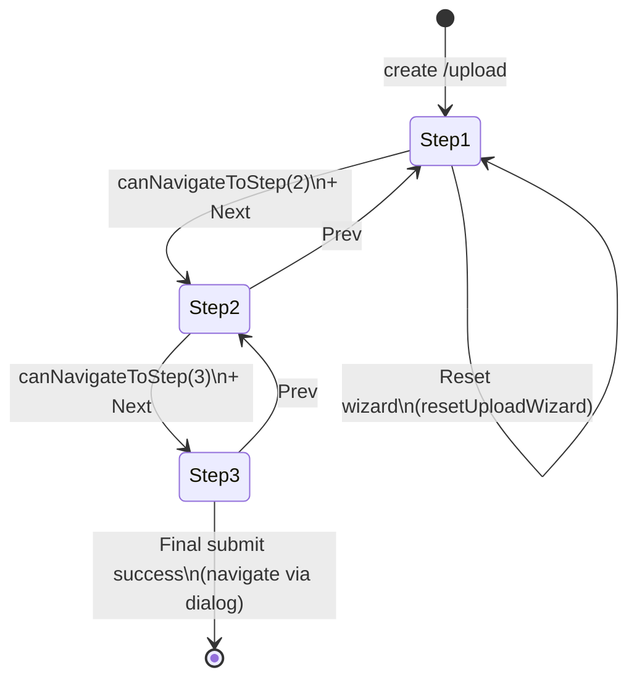

# Audit — Upload Music Wizard (Luồng đóng góp 3 bước)

> **Phạm vi:** Luồng **Đóng góp bản thu** (`/upload`) và **Chỉnh sửa bản thu** (`/recordings/:id/edit`), cùng shell bọc `UploadPage` / `EditRecordingPage`. Đối tượng chính: `UploadMusic.tsx` và các hook/features upload.
>
> **Chi tiết bước 2 (Metadata & AI):** [`AUDIT-upload-step-2-metadata.md`](./AUDIT-upload-step-2-metadata.md) — tài liệu này tập trung **toàn luồng wizard**, **submit pipeline**, **validation**, **API**, **edge cases**.

**Audited:** 2026-05-10

---

## Mục lục

1. [Điểm vào & phân quyền](#1-điểm-vào--phân-quyền)
2. [Bản đồ kiến trúc](#2-bản-đồ-kiến-trúc-orchestrator--hooks--ui)
3. [Hai chế độ: wizard vs chỉnh sửa](#3-hai-chế-độ-wizard-tạo-mới-vs-chỉnh-sửa)
4. [Ba bước — điều kiện & hiển thị](#4-ba-bước--điều-kiện--hiển-thị)
5. [Máy trạng thái & luồng điều hướng](#5-máy-trạng-thái--luồng-điều-hướng)
6. [Ma trận validation (3 lớp)](#6-ma-trận-validation-3-lớp)
7. [Pipeline submit: draft vs final](#7-pipeline-submit-draft-vs-final)
8. [Pipeline bước 1: `handleUploadAndCreateDraft`](#8-pipeline-bước-1-handleuploadandcreatedraft)
9. [Giới hạn file & MIME](#9-giới-hạn-file--mime)
10. [Điều kiện theo `performanceType`](#10-điều-kiện-theo-performancetype)
11. [Hai khối `UploadWizardActions`](#11-hai-khối-uploadwizardactions)
12. [Điểm chạm API / dịch vụ](#12-điểm-chạm-api--dịch-vụ)
13. [Chỉnh sửa bản ghi (`EditRecordingPage`)](#13-chỉnh-sửa-bản-ghi-editrecordingpage)
14. [Biến môi trường](#14-biến-môi-trường)
15. [Luồng phụ: ảnh, GPS, ảnh sau upload](#15-luồng-phụ-ảnh-gps-ảnh-sau-upload)
16. [Navigation guard](#16-navigation-guard-rời-trang)
17. [Vấn đề & mức độ](#17-vấn-đề--mức-độ)
18. [Liên quan audit khác](#18-liên-quan-audit-khác)
19. [Checklist QA](#19-checklist-qa)
20. [Hướng cải tiến](#20-hướng-cải-tiến)

**Phụ lục — production readiness (nâng cao):**

21. [Async Failure Matrix](#21-async-failure-matrix-sản-xuất)
22. [State Ownership & Source-of-Truth](#22-state-ownership--source-of-truth-audit)
23. [Performance & Rendering](#23-performance--rendering-audit)
24. [Security & Data Integrity](#24-security--data-integrity-audit)
25. [Accessibility & UX Resilience](#25-accessibility--ux-resilience-audit)
26. [Architecture Risk Scoring](#26-architecture-risk-scoring)

---

## 1. Điểm vào & phân quyền

| Điểm vào | Component | Ghi chú |
|----------|-----------|---------|
| `/upload` | `UploadPage` → `<UploadMusic />` | Sidebar “Luồng 3 bước”, popup hướng dẫn; **card form** `opacity-50` + `pointer-events-none` khi user không phải **CONTRIBUTOR** (`UploadPage.tsx`). |
| `/recordings/:id/edit` | `EditRecordingPage` → `<UploadMusic recordingId={id} isApprovedEdit />` | Không stepper (`showWizard = false`). Quyền edit được kiểm tra **trước** trong `EditRecordingPage` (owner + trạng thái moderation); `UploadMusic` chỉ khóa form theo role + đăng nhập. |

**Trong `UploadMusic.tsx`:**

- **Đóng góp mới:** chỉ **CONTRIBUTOR** có form tương tác (`isFormDisabled` khi không đúng role).
- **`isApprovedEdit`:** **CONTRIBUTOR** hoặc **EXPERT** — dùng khi chỉnh sửa bản đã duyệt (không reset trạng thái moderation như luồng contributor thường; chi tiết trong `useUploadSubmission` khi gửi payload).

---

## 2. Bản đồ kiến trúc (orchestrator → hooks → UI)

| Lớp | File / thành phần | Vai trò |
|-----|-------------------|---------|
| Shell `/upload` | `UploadPage.tsx` | Layout 2 cột (aside sticky + main), CTA đăng nhập, popup “Hướng dẫn đóng góp”. |
| Orchestrator | `UploadMusic.tsx` (~1108 dòng) | Ghép hooks; điều kiện `uploadWizardStep` / `isEditMode`; `validateForm`; guards; `resetForm`; fetch ảnh hiển thị. |
| Stepper | `UploadWizardStepper.tsx` | 3 bước có `aria-*`; mobile: chấm tiến độ + nhãn; desktop: nút bước + connector. |
| Actions | `UploadWizardActions.tsx` | **Quay lại** / **Tiếp theo** (`disabled` = `!canNavigateToStep(step+1)`); **Lưu** (bước 2–3); **Đặt lại** / submit (bước 3 hoặc edit). |
| Wizard | `useUploadWizard.ts` | `uploadWizardStep`, `canNavigateToStep`, `goNext`/`goPrev`, `reset`; scroll top với `prefers-reduced-motion`. |
| Form | `useUploadForm.ts` | State metadata + GPS + AI suggest flags; **`requiresInstruments`**, **`allowsLyrics`** derive từ `performanceType`. |
| Media | `useMediaUpload.ts` | File, MIME/extension, byte cap, `createdRecordingId`, URL preview, phân tích duration/bitrate client-side. |
| Submit | `useUploadSubmission.ts` | `handleUploadAndCreateDraft`, `handleConfirmSubmit(isFinal)` — Supabase, `recordingService`, `submissionService`, mapping ID địa lý → payload. |
| Reference | `useUploadReferenceData.ts` | Ethnicity, provinces/districts/communes, instruments, ceremonies, vocal styles… |
| Loader edit | `useUploadRecordingLoader.ts` | Hydrate form từ recording + query (`edit`, `id`). |
| Effects edit | `useUploadEditReferenceEffects.ts`, `useUploadEditCommuneProvinceEffect.ts` | Đồng bộ dropdown sau khi load ID ban đầu. |
| Validation | `uploadFormValidation.ts` | `validateUploadFormState`, `isUploadFormComplete`, `scrollToFirstUploadError`. |
| Dialog chrome | `useUploadDialogChrome.ts` | Escape / overlay khi dialog xác nhận hoặc success. |
| UI bước 1 | `MediaUploadStep.tsx` | File picker, AI toggle, instrument bars, ảnh đính kèm. |
| UI bước 2 | `UploadFormFields.tsx` → `MetadataStepSection.tsx` | Toàn bộ metadata + GPS + panels gợi ý. |

---

## 3. Hai chế độ: wizard (tạo mới) vs chỉnh sửa

| Khía cạnh | Tạo mới (`showWizard = !isEditMode`) | Chỉnh sửa (`isEditMode` / `recordingId`) |
|-----------|--------------------------------------|-------------------------------------------|
| `UploadWizardStepper` | `showWizard={true}` → hiển thị | `showWizard={false}` → ẩn |
| `MediaUploadStep` | `show={uploadWizardStep === 1}` | `show={step === 1 \|\| !showWizard}` → **luôn** hiển thị |
| `UploadFormFields` | `show={uploadWizardStep === 2}` | `show={step === 2 \|\| !showWizard}` → **luôn** hiển thị |
| `UploadMediaPreview` | `show={!isEditMode && uploadWizardStep === 2}` | Không (preview URL wizard sau upload) |
| Khối bước 3 (ghi chú mô tả, quản trị, nút cuối) | `uploadWizardStep === 3 \|\| !showWizard` | Luôn phần “bước 3” khi không wizard |

**Query / props kích hoạt edit:** `?edit=true`, `?id=`, hoặc prop `recordingId` từ route — `isEditModeParam` trong `UploadMusic` gộp các trường hợp.

---

## 4. Ba bước — điều kiện & hiển thị

### 4.1 Bước 1 — Tải lên

- **Client:** `useMediaUpload` — MIME hoặc extension fallback (`inferMimeFromName`), không đổi audio↔video trong cùng phiên; giới hạn byte (`§9`).
- **Để mở khóa bước 2** (`canNavigateToStep(2)` trong `useUploadWizard.ts`): có media (`file` hoặc `existingMediaSrc` khi edit); **tạo mới** thêm điều kiện **`createdRecordingId`** (recording đã tạo trên server sau upload — xem `§8`).
- **`handleNextStep` (bước 1):** chỉ báo lỗi nếu thiếu file khi không có media hiện có — **không** kiểm tra `createdRecordingId`; điều kiện “chặt” nằm ở **`disabled` của nút Tiếp theo** (`UploadWizardActions`: `!canNavigateToStep(uploadWizardStep + 1)`).

### 4.2 Bước 2 — Metadata & AI

- **Hiển thị:** `UploadMediaPreview` (wizard, sau khi có URL) + `UploadFormFields`.
- **Sang bước 3:** `canNavigateToStep(3)` — title, artist (hoặc unknown), **composer** (hoặc unknown), performanceType; vocal bắt buộc cho `vocal_accompaniment` / `acappella`; nhạc cụ nếu `requiresInstruments` (`useUploadWizard.ts` + `useUploadForm.ts`).
- **`handleNextStep` (bước 2, create):** kiểm tra **subset** (thiếu composer trong đoạn này); nút **Tiếp theo** vẫn phụ thuộc `canNavigateToStep(3)` — **composer đã được kiểm tra ở đó**. Rủi ro drift nếu sau này bỏ `disabled` hoặc thêm phím tắt.

### 4.3 Bước 3 — Xem lại & Gửi

- **Nội dung:** các khối tóm tắt (trong `UploadMusic`) + **Ghi chú bổ sung** (mô tả, ghi chú thực địa, phiên âm) + **Thông tin quản trị và bản quyền** (collector, copyright, archive, catalog — optional).
- **Submit:** `validateUploadFormState` → `UploadConfirmDialogs` → `handleConfirmSubmit(true)` (`§7`).
- **Lưu nháp:** cùng `validateUploadFormState` → `handleConfirmSubmit(false)` — **không** shortcut validation.

**`isUploadFormComplete`** (cùng rule cốt lõi với validation submit) điều khiển tooltip/disabled nút **Đóng góp** / **Hoàn tất chỉnh sửa** (`UploadWizardActions`).

---

## 5. Máy trạng thái & luồng điều hướng

- **`goNext` / `goPrev`:** clamp 1–3, luôn `scrollToTop` (smooth trừ khi reduce motion).
- **Click stepper:** `onStepChange(step)` chỉ khi `canNavigateToStep(step)` — không “nhảy cóc” qua bước chưa đủ điều kiện.
- **Edit mode:** step luôn 1 trong state nhưng UI không chia bước; stepper ẩn — người dùng thấy media + form + footer trong một view.

---

## 6. Ma trận validation (3 lớp)

| Trường / điều kiện | `canNavigateToStep` (`useUploadWizard`) | `handleNextStep` errors (`UploadMusic`) | `validateUploadFormState` / `isUploadFormComplete` |
|--------------------|----------------------------------------|----------------------------------------|-----------------------------------------------------|
| File media (create) | Cần cho step ≥2 | Bước 1: kiểm tra file | Cần `file` khi `!isEditMode` |
| `createdRecordingId` (create) | Cần cho step ≥2 | Không kiểm tra | Không kiểm tra trực tiếp (giả định đã có sau flow bước 1) |
| Title | Cần cho step ≥3 | Bước 2: có | Có |
| Artist / unknown | Cần cho step ≥3 | Bước 2: có | Có |
| Composer / unknown | Cần cho step ≥3 | **Không** trong `handleNextStep` | Có |
| Performance type | Cần cho step ≥3 | Bước 2: có | Có |
| Vocal style | Nếu vocal / acappella | Bước 2: có | Có |
| Instruments | Nếu `requiresInstruments` | Bước 2: có | Có |

**Kết luận:** “Nguồn sự thật” cho **Tiếp theo** là `canNavigateToStep`; **submit** là `validateUploadFormState`. `handleNextStep` là lớp trung gian — dễ lệch nếu refactor không đồng bộ.

---

## 7. Pipeline submit: draft vs final

Cả hai nhánh đều gọi `handleConfirmSubmit(isFinal)` trong `useUploadSubmission.ts`.

1. **`targetId`:** `editingRecordingId` (edit) hoặc `createdRecordingId` (create). Thiếu → lỗi: *“Không tìm thấy ID bản thu…”*.
2. **`recordingService.updateRecording(targetId, payload)`** luôn chạy — payload `RecordingUploadDto`: URL media (`newUploadedUrl` hoặc `existingMediaSrc`), duration/size/format, GPS, IDs địa lý đã resolve tên → id, `instrumentIds`, `composer`, ngôn ngữ, `performanceContext`, v.v.
3. **`status: 1`** chỉ gắn khi **`isFinal && !isEditMode`** (submit cuối lần đầu).
4. **Nếu `isFinal`:**
   - Cần **`currentSubmissionId`** — thiếu → throw với thông báo hướng dẫn thử lại / mở từ Đóng góp.
   - `submissionService.confirmSubmission(subId)` — xác nhận bản đóng góp.
   - Toast/backend notification: comment trong code — tránh double notification phía FE.
5. **Nếu contributor đang edit** và có `currentSubmissionId`: **best-effort** `submissionVersionApi.create` (ghi changelog ngắn) cho cả draft save và final.
6. **Draft (`!isFinal`):** toast `upload.save.success_draft` / `upload.save.success_edit`; không đặt `submitStatus === 'success'` như nhánh final (final set message + dialog success trong UI khác).

**Lỗi:** parse `response.data` (string / object / validation errors) → `setSubmitStatus('error')` + message chi tiết; `reportError` với `region: 'upload', stage: 'submit'`.

---

## 8. Pipeline bước 1: `handleUploadAndCreateDraft`

**Early exit:** `if (!file || createdRecordingId) return` — không upload trùng khi đã có recording.

**Tiến độ:** `setInterval` ~500ms tăng progress tới ~95% (UX); hoàn tất 99% → 100% trong `finally` / cuối try.

**Hai nhánh `useAiAnalysis`:**

| Nhánh | Việc làm |
|-------|----------|
| **Có** `useAiAnalysis` | `Promise.allSettled`: (1) `uploadFileToSupabase(file)`, (2) `legacyPost('/AIAnalysis/analyze-only', formData)` timeout **300000 ms**, (3) nếu audio + `instrumentDetectionFlags.confidenceEnabled` → `instrumentDetectionService.analyzeOnlyFromFile`. Merge ML + AI instruments; báo lỗi partial qua toast (`upload.ai.partial_fail`) + `reportError`. |
| **Không** | Chỉ Supabase upload; xóa predictions/suggestions. |

**Sau upload:**

- **Create mode:** `recordingService.createSubmission({ audioFileUrl / videoFileUrl, uploadedById })` → `setCreatedRecordingId`, `setCurrentSubmissionId`.
- **Edit mode upload media mới:** `setCreatedRecordingId('EDIT_MODE_UPLOADED')` — sentinel cho logic phụ trợ.
- Ảnh đính kèm: upload qua `recordingImageService.uploadImage(recordingId, file)` nếu có; refresh URLs `fetchRecordingImageDisplayUrls`.

**Populate form từ AI:** ngôn ngữ, địa điểm, ethnicity (hoặc “Khác” + custom), instruments, vocalStyle, region, ceremony, performanceType (kể cả map chuỗi tiếng Việt), v.v. Comment trong code mô tả pipeline **AI-direct suggestions** + **instrument → metadata** (`instrumentMetadataMapper`).

---

## 9. Giới hạn file & MIME

| Nguồn | Giá trị |
|-------|---------|
| Audio max | **200 MB** — `MAX_AUDIO_UPLOAD_BYTES` (`src/config/validationConstants.ts`), re-export trong `uploadConstants.ts` |
| Video max | **2 GB** — `MAX_VIDEO_UPLOAD_BYTES` |
| MIME audio | `SUPPORTED_AUDIO_FORMATS` — mp3/wav/flac (+ biến thể vendor) |
| MIME video | `SUPPORTED_VIDEO_FORMATS` — mp4, mov, avi, webm, mkv, … |
| Fallback extension | `inferMimeFromName` — cho phép một số file khi MIME trống |

---

## 10. Điều kiện theo `performanceType`

Định nghĩa trong `useUploadForm.ts`:

- **`requiresInstruments`** = `instrumental` **hoặc** `vocal_accompaniment`  
  → Form bắt buộc chọn ít nhất một nhạc cụ (khớp `PERFORMANCE_TYPES` trong UI: 3 lựa chọn).

- **`allowsLyrics`** = `acappella` **hoặc** `vocal_accompaniment`  
  → Điều khiển hiển thị / upload file lời (lyrics).

**Cảnh báo biên:** pipeline AI / backend có thể đặt `performanceContext` thành giá trị **không** nằm trong 3 key UI (ví dụ `instrumental_solo`, `instrumental_ensemble` trong `useUploadSubmission` mapping). Khi đó:

- `requiresInstruments` có thể **false** dù ngữ nghĩa vẫn là “nhạc cụ” — có thể **không** bắt buộc nhạc cụ trong validation.
- Người dùng có thể thấy combo “lạ” giữa nhãn AI và dropdown cố định — đáng ghi vào backlog QA.

---

## 11. Hai khối `UploadWizardActions`

Trong `UploadMusic.tsx` có **hai** instance:

| Instance | `showFinalActions` | `showWizard` | Khi nào render |
|----------|-------------------|--------------|----------------|
| Trong `(uploadWizardStep === 3 \|\| !showWizard)` | **true** | **false** | Bước 3 hoặc edit: nút **Đặt lại**, **Lưu**, **Đóng góp** / **Hoàn tất chỉnh sửa** |
| Cuối form | **false** | **`showWizard`** | Wizard: thanh **Quay lại** + **Tiếp theo** (+ **Lưu** ở bước 2–3) |

**Chế độ chỉnh sửa:** `showWizard={false}` → nhánh `{showWizard && (…)}` trong `UploadWizardActions` **không** render thanh Quay lại/Tiếp theo; chỉ còn khối có `showFinalActions={true}` (Đặt lại / Lưu / Đóng góp hoặc Hoàn tất). **Chế độ wizard:** khối cuối form render thanh bước; khối trong nhánh bước 3 render nút submit cuối — không trùng vì `showFinalActions` loại trừ lẫn nhau theo JSX.

---

## 12. Điểm chạm API / dịch vụ

| Hành động | Dịch vụ / endpoint (từ code) |
|-----------|-------------------------------|
| Upload file | `uploadService.uploadFileToSupabase` |
| Phân tích AI (optional) | `legacyPost('/AIAnalysis/analyze-only', …)` |
| Instrument ML | `instrumentDetectionService.analyzeOnlyFromFile` |
| Tạo submission/recording draft | `recordingService.createSubmission` |
| Cập nhật metadata & media | `recordingService.updateRecording` |
| Xác nhận đóng góp | `submissionService.confirmSubmission` |
| Phiên bản submission (contributor edit) | `submissionVersionApi.create` |
| Ảnh minh họa | `recordingImageService.uploadImage`, `fetchRecordingImageDisplayUrls` |
| Gợi ý metadata (nút riêng) | `metadataSuggestService.suggestMetadata` |
| Geocode GPS | `geocodeService.getAddressFromCoordinates` |

---

## 13. Chỉnh sửa bản ghi (`EditRecordingPage`)

Điều kiện **canEdit** (tóm tắt logic trong `EditRecordingPage.tsx`):

- **Rejected vĩnh viễn:** không ai edit.
- **Contributor + owner:** approved hoặc temporarily rejected, không `contributorEditLocked`.
- **Expert:** chỉ khi **approved**.
- **Admin:** approved hoặc temporarily rejected.

Sau đó render `<UploadMusic recordingId={id} isApprovedEdit />` — payload submit giữ moderation phù hợp expert/contributor (`useUploadSubmission`).

---

## 14. Biến môi trường

| Biến | Ảnh hưởng tới wizard |
|------|----------------------|
| `VITE_INSTRUMENT_DETECTION_MOCK` | Mock phát hiện nhạc cụ (servicing `instrumentDetectionService`) |
| `VITE_INSTRUMENT_CONFIDENCE` | Cờ confidence / ngưỡng hiển thị (xem `instrumentConfidence.ts` / service) |

Chi tiết giải thích UX “AI nhạc cụ” trong [`AUDIT-upload-step-2-metadata.md`](./AUDIT-upload-step-2-metadata.md).

---

## 15. Luồng phụ: ảnh, GPS, ảnh sau upload

- **`useEffect` ảnh:** khi có `editingRecordingId` hoặc `createdRecordingId` (và không sentinel chỉ edit upload), gọi `fetchRecordingImageDisplayUrls(rid)` → `setExistingRecordingImageUrls`.
- **GPS:** `handleGetGpsLocation` trong `useUploadForm` — `navigator.geolocation`, reverse geocode, gợi ý vùng cho metadata suggest (xem audit bước 2).

---

## 16. Navigation guard (rời trang)

- **`beforeunload`:** khi `isEditMode` **hoặc** `uploadWizardStep >= 2`, và có nhập liệu “có ý nghĩa” (title, artist, composer, vocalStyle, description…), trừ khi đang submit hoặc đã success.
- **`useBlocker`:** cùng điều kiện block; chỉ khi đổi **pathname**; xác nhận `window.confirm`.

Comment code *“Step 2-4”* trong `UploadMusic.tsx` là **sai số bước** (wizard chỉ 3 bước) — đối chiếu [`AUDIT-upload-step-2-metadata.md`](./AUDIT-upload-step-2-metadata.md) **D1**.

---

## 17. Vấn đề & mức độ

| ID | Mô tả | Mức |
|----|--------|-----|
| **W1** | `UploadMusic.tsx` ~1108 dòng — khó bảo trì. | P2 |
| **W2** | Ba lớp validation — trùng / dễ drift (`§6`). | P2 |
| **W3** | Bước 1: user phải hiểu cần **tạo draft** (`createdRecordingId`) không chỉ chọn file. | P3 |
| **W4** | SLA “5–10 ngày” hardcode trong popup `UploadPage`. | P3 |
| **W5** | Non-contributor: form mờ, sidebar vẫn đọc được — có thể nhầm. | P3 |
| **W6** | Giá trị `performanceType` / AI có thể lệch với 3 option UI → rule `requiresInstruments` có thể không khớp ngữ nghĩa (`§10`). | P2 |

Chi tiết UX/metadata bước 2: [`AUDIT-upload-step-2-metadata.md`](./AUDIT-upload-step-2-metadata.md).

---

## 18. Liên quan audit khác

- [`AUDIT-dead-code-hardcode.md`](./AUDIT-dead-code-hardcode.md) — `console.*`, upload hooks.
- [`AUDIT-upload-step-2-metadata.md`](./AUDIT-upload-step-2-metadata.md) — Metadata & AI.

---

## 19. Checklist QA

- [ ] CONTRIBUTOR `/upload`: form hoạt động; non-contributor: không tương tác + banner đăng nhập.
- [ ] Bước 1: MIME/extension; vượt 200MB / 2GB → lỗi.
- [ ] Bước 1: sau **Tải lên tạo draft** có `createdRecordingId` → **Tiếp theo** mở.
- [ ] Bật/tắt AI analysis: nhánh Supabase-only vs parallel AI + detection.
- [ ] Bước 2: đủ field; vocal vs instrumental; nhạc cụ bắt buộc khi `vocal_accompaniment` / `instrumental`.
- [ ] Bước 3: submit mở confirm dialog; progress overlay; success → điều hướng theo `UploadConfirmDialogs`.
- [ ] **Lưu** nháp: toast, không yêu cầu confirm như final (theo UX hiện tại).
- [ ] Đổi route khi có draft nhập → confirm.
- [ ] EditRecordingPage: từng vai trò + trạng thái moderation (owner, expert, admin, rejected).

---

## 20. Hướng cải tiến

1. Tách `UploadMusic` thành các component/hook: review step, guards, summary blocks.
2. Gom validation một module (hoặc vitest matrix `step × field × mode`).
3. Sửa comment guard; xem xét thống nhất `performanceType` enum UI vs AI.
4. Chuẩn hóa SLA / copy với vận hành.

---

# Phụ lục — Production readiness (nâng cao)

> Các mục dưới đây **bổ sung** cho audit chức năng ở trên; không lặp lại kiến trúc/validation/pipeline đã mô tả. Trọng tâm: **an toàn bất đồng bộ**, **sở hữu state**, **hiệu năng**, **trust boundary**, **a11y/resilience**, **điểm số rủi ro**.

---

## 21. Async Failure Matrix (sản xuất)

| Vấn đề | Trigger | Ảnh hưởng | Severity | Rủi ro hiện tại | Khuyến nghị giảm thiểu |
|--------|---------|-----------|----------|-----------------|-------------------------|
| **Race — double draft upload** | Người dùng bấm **Tải lên / tạo bản nháp** hai lần nhanh trước khi `createdRecordingId` được set; `handleUploadAndCreateDraft` chỉ `return` khi **đã có** `createdRecordingId`, không khóa in-flight. | Hai luồng song song: upload Supabase + AI + `createSubmission` — duplicate recording/submission phía server, chi phí storage/API. | **High** | **Cao** nếu không có idempotency BE | Khóa UI (`isUploadingMedia` đã có nhưng race cực hiếm vẫn có thể xảy ra trước re-render); thêm **`useRef` inFlight** hoặc **disable nút ngay trong handler**; BE: idempotency key / dedupe theo client request id. |
| **Race — double final submit** | Double-click **Đóng góp** sau dialog hoặc hai lần **Lưu** nhanh; `handleConfirmSubmit` gọi `setIsSubmitting(true)` nhưng không có **synchronous mutex** — hai tick có thể vào trước khi React commit state. | Hai `updateRecording` + có thể hai `confirmSubmission` → trạng thái submission không xác định, thông báo trùng. | **Medium–High** | **Trung bình** | `if (submitLockRef.current) return; submitLockRef.current = true` ở đầu handler; giữ nút disabled + `pointer-events-none` trên dialog confirm khi `isSubmitting`. |
| **Stale closure trong `useUploadSubmission`** | `useCallback(..., [options])` phụ thuộc toàn bộ object `options` — mỗi render parent tạo object mới có thể làm callback “mới” nhưng vẫn đọc snapshot cũ nếu async await dài. | Payload submit dùng field form **cũ** so với UI hiển thị (hiếm, nhưng có thể khi user sửa form trong lúc request pending). | **Low–Medium** | **Thấp** | Thu hẹp dependency bằng **stable refs** cho giá trị cần snapshot tại thời điểm submit; hoặc truyền **frozen draft object** vào `handleConfirmSubmit`. |
| **Unmounted setState sau async** | User rời `/upload` khi `handleUploadAndCreateDraft` hoặc `handleConfirmSubmit` đang chờ; không có **AbortController** / cancelled flag cho toàn bộ chain. | React warning “Can’t perform state update on unmounted component”; có thể cập nhật UI sai route. | **Medium** | **Trung bình** trên mạng chậm | Pattern **`let cancelled = false`** + cleanup trong `useEffect`; trong `finally` của submission: `if (!cancelled) setState`; hoặc **React Query / mutation** với cancel. `useMediaUpload` đã có `cleanedUp` cho metadata element — **chưa** áp dụng đồng nhất cho upload pipeline. |
| **Promise.allSettled partial failure** | Một nhánh reject (AI hoặc ML detection) trong khi Supabase OK. | Recording vẫn tạo; UI toast partial fail — trạng thái “đã draft nhưng AI lỗi” có thể gây nhầm khi user sang bước 2. | **Low** | **Đã xử lý một phần** (toast + reportError) | Chuẩn hóa **trạng thái hiển thị** (banner “Phân tích AI không đầy đủ”) và **không** ghi đè field tay khi AI fail (đã có nhánh tách — cần QA matrix). |
| **Timeout không đồng nhất** | `analyze-only` timeout **300000 ms**; các fetch khác dùng default client. | AI treo lâu — user có thể đổi bước hoặc submit trong khi client vẫn chờ (xem hàng dưới). | **Medium** | **Trung bình** | Global upload mutation state + **disable navigation** khi `aiAnalysisLoading \|\| isUploadingMedia`; hoặc hủy request qua AbortSignal. |
| **Đổi bước wizard khi AI / upload chưa xong** | Nút **Tiếp theo** chỉ `disabled={!canNavigateToStep(step+1)}` — **không** gắn `isUploadingMedia`, `aiAnalysisLoading`, `isAnalyzing` (đọc `UploadWizardActions.tsx`). | User vào bước 2 khi URL recording / gợi ý chưa ổn định; mismatch giữa “đã có draft” và trạng thái hiển thị AI. | **Medium** | **Cao** về UX/consistency | `disabled={!canNavigateToStep(...) \|\| isUploadingMedia \|\| aiAnalysisLoading \|\| isAnalyzing}` cho bước 1→2; hoặc `canNavigateToStep` nhận thêm flags. |
| **Spam submit / abuse** | Nhiều lần confirm hoặc script gọi API. | Tải trọng API, queue moderation — FE không rate-limit. | **Medium** (ops) | **Phụ thuộc BE** | Rate limit / WAF phía server; optional cooldown nút submit phía FE. |
| **Retry “an toàn”** | User bấm lại sau lỗi mạng giữa `updateRecording` và `confirmSubmission`. | **Split-brain**: recording đã cập nhật nhưng submission chưa confirm — BE có thể ở trạng thái orphan cần reconcile. | **High** (data integrity) | **Không chắc** — cần BE | Transaction / saga idempotent; FE hiển thị **recovery UI** (“Đang xác nhận…”) và poll trạng thái submission. |
| **Duplicate draft creation (logic)** | Early exit `if (!file \|\| createdRecordingId) return` — sau khi có id, không chọn file mới thì không upload lại (đúng); đổi file reset `createdRecordingId` ở `useMediaUpload` — OK. | Edge: edit mode sentinel `EDIT_MODE_UPLOADED`. | **Low** | **Thấp** | Giữ test regression khi đổi file trong edit. |

---

## 22. State Ownership & Source-of-Truth Audit

### Ownership map (tóm tắt)

| State / concern | Owner chính | Nguồn sự thật thực tế | Ghi chú |
|-----------------|-------------|----------------------|---------|
| File, MIME, duration client, `createdRecordingId`, `newUploadedUrl`, progress upload | `useMediaUpload` | Local + server sau `createSubmission` | `createdRecordingId` là **điều kiện cửa** sang bước 2 (wizard). |
| Toàn bộ field form metadata, GPS, submit flags | `useUploadForm` | **Optimistic client** cho đến khi `updateRecording` | Không có normalized server cache (không React Query entity). |
| Reference lists (ethnicity, tỉnh, …) | `useUploadReferenceData` | API reference data | Invalidate có thể xảy ra giữa chừng form đang mở → **desync tên vs id** nếu user chọn trước khi refetch. |
| Wizard step index | `useUploadWizard` | **Pure UI** | Không persist — refresh mất bước. |
| Submission/recording ids | `useMediaUpload` + `useUploadSubmission` | Server | `currentSubmissionId` phụ thuộc flow tạo draft — lỗi “không tìm thấy mã đóng góp” khi lệch. |
| Ảnh hiển thị existing | `UploadMusic` effect + `fetchRecordingImageDisplayUrls` | Server | Song song với `recordingImages` File[] local — hai nguồn ảnh. |

### Derived state & rủi ro

| Derived | Công thức | Rủi ro |
|---------|-----------|--------|
| `requiresInstruments` | `performanceType === 'instrumental' \|\| 'vocal_accompaniment'` | AI có thể set giá trị **ngoài** 3 option UI → validation không khớp ngữ nghĩa (§10/W6). |
| `allowsLyrics` | `acappella \|\| vocal_accompaniment` | OK nếu `performanceType` luôn thuộc tập chuẩn. |
| `isFormComplete` / `validateUploadFormState` | Cùng rule validation | Ba lớp + wizard step — **desync** đã nêu §6. |
| Resolve ID (province → district → commune) | `find` theo **tên** trong `handleConfirmSubmit` | Đổi dữ liệu reference sau khi user chọn → **id sai hoặc undefined** silently. |

### Coupling ẩn

- **`useUploadSubmission` nhận `options` khổng lồ** — coupling chặt với mọi field `UploadMusic`; khó test đơn vị.
- **`useUploadWizard.canNavigateToStep`** không biết `isUploadingMedia` / AI — coupling **thiếu** (under-sync) giữa wizard và async pipeline.

### Biên giới đề xuất

| Hướng | Mô tả |
|-------|--------|
| **Upload session machine** | Một hook/context: `idle → analyzing_local → uploading → draft_created → ai_running → ready_for_step_2` với flags export cho stepper + guards. |
| **Normalized recording draft** | Object immutable snapshot sau mỗi bước server thành công; form hydrate từ snapshot để giảm stale field. |
| **Tách submit payload builder** | Pure function `buildRecordingPayload(formState, referenceData)` — test được, không phụ thuộc closure hook. |

---

## 23. Performance & Rendering Audit

| Hotspot | Triệu chứng đo được | Severity | Tác động runtime | Khuyến nghị |
|---------|---------------------|----------|------------------|-------------|
| **`UploadMusic.tsx` monolith** | Một state nhỏ trong `useUploadForm` hoặc wizard khiến **toàn bộ** form re-render. | **High** | Jank trên thiết bị yếu; nhập liệu lag | Tách **UploadWizardLayout**, **Step1/2/3** container; `React.memo` cho section ít đổi (sidebar đã ở `UploadPage`). |
| **Prop drilling sâu** | Hàng trăm props truyền xuống `MediaUploadStep`, `UploadFormFields`. | **Medium** | Re-render cascade | Context nhẹ theo **step** hoặc composition (render props) chỉ cho subtree upload. |
| **`genreEthnicityWarning` `useMemo`** | Phụ thuộc vocalStyle + ethnicity — OK. | Low | Nhỏ | Giữ; đảm bảo deps đầy đủ. |
| **Object URL (`URL.createObjectURL`)** | `useMediaUpload` có cleanup trong `cleanup()` khi load metadata xong / lỗi. | **Low–Medium** | Rò bộ nhớ tab nếu unmount trước cleanup | Thêm **cleanup trên unmount** effect riêng revoke URL nếu pipeline kéo dài. |
| **Recording image previews** | FileReader async push vào mảng preview. | **Medium** | Bộ nhớ hình ảnh lớn | Giới hạn số file / kích thước; revoke preview URL khi remove. |
| **`setInterval` progress (500ms)** | Cập nhật progress trong khi upload AI. | **Low** | Wake layout không cần thiết | `requestAnimationFrame` hoặc ít tick hơn; hoặc chỉ bump khi % thay đổi đáng kể. |
| **useEffect chains** | Loader edit + commune effect + reference effects | **Medium** | Cascade setState, flash UI | Gộp **single orchestrator effect** với thứ tự rõ; hoặc state machine. |
| **AI metadata hydration** | Sau `analyze-only`, nhiều `setX` tuần tự | **Medium** | Nhiều paint | `unstable_batchedUpdates` hoặc gom một `applyAiSuggestionPatch` object. |
| **Virtualization** | Danh sách dropdown dài (instruments, communes) | **Low** | Scroll nặng | `UploadSearchableDropdown` đã hướng virtual — kiểm tra list >200 items. |

**Ứng viên `useMemo` / `useCallback`:** handlers đã `useCallback` ở một phần — ưu tiên **memo hóa component con** nhận object/array props ổn định (stepper, preview).

---

## 24. Security & Data Integrity Audit

| Rủi ro | Bề mặt tấn công / lỗi | FE hiện tại | Giả định nguy hiểm | Phân loại giảm thiểu |
|--------|----------------------|-------------|-------------------|---------------------|
| **MIME / extension spoof** | File `.mp3` thực chất binary khác | Kiểm tra `File.type` + extension fallback | Client có thể bị bypass | **FE:** defense in depth (magic byte sniff tùy chọn). **BE:** validate content-type, virus scan, giới hạn. |
| **Oversized payload** | Body metadata khổng lồ | Một phần giới hạn file; field text ít khi clamp | DoS storage/API | **BE:** max body, field length. **FE:** align với `validationConstants` cho textarea nếu có. |
| **GPS spoof** | User fake geolocation / mock browser | Gửi lat/lon lên server như dữ liệu người dùng nhập | Coi GPS là **gợi ý địa lý**, không chứng thực | **BE:** optional sanity check; expert review workflow đã là kiểm soát chính. |
| **AI-suggested metadata** | Prompt injection qua file audio khó; risk chủ yếu **sai văn hóa** | Form cho phép áp dụng gợi ý | Expert moderation là **gate** | Nhãn UI “gợi ý, cần xác minh”; không auto-publish. |
| **Client validation bypass** | Gọi API trực tiếp | Mọi rule bắt buộc phải **lặp lại BE** | FE chỉ UX | **BE-authoritative:** ownership recording, submission state machine, confirmSubmission authorization. |
| **Duplicate / replay upload** | Trùng file hash | Không thấy dedupe FE | Storage waste | **BE:** hash idempotency; **FE:** optional disable sau success. |
| **`uploadedById` fallback `'1'`** | Trong payload khi thiếu user id | Code path trong `useUploadSubmission` | **Nguy hiểm** nếu BE chấp nhận | **BE:** từ chối nếu không khớp JWT; **FE:** không fallback silent — fail fast. |

**Trust boundary:** Coi FE là **không tin cậy** — mọi quyết định pháp lý / moderation / ownership là **backend + policy**.

---

## 25. Accessibility & UX Resilience Audit

| Chủ đề | Hiện trạng (từ kiến trúc đã có) | WCAG / UX risk | Cải thiện |
|--------|-------------------------------|----------------|-----------|
| **Keyboard** | Stepper có `button` + `aria-label`; form có field ids | Focus sau lỗi có scroll nhưng không trap hợp lý trong modal | Focus đầu tiên vào heading dialog khi mở confirm |
| **Screen reader — tiến độ upload** | `UploadProgressDialog` — cần kiểm tra `role="alert"` / `aria-busy` trên form | Thông báo % không live | `aria-live="polite"` cho progress text |
| **Reduced motion** | `useUploadWizard` đã dùng `prefers-reduced-motion` cho scroll | OK | Mở rộng cho animation dialog/CSS |
| **Validation discoverability** | Lỗi map vào `field-*` scroll | Color-only risk nếu chỉ border đỏ | Đảm bảo `aria-invalid` + message liên kết `aria-describedby` |
| **Mobile** | Touch target stepper ~44px (`min-h-[44px]`) | OK hướng | Kiểm tra overlay keyboard che nút |
| **Low bandwidth / interruption** | Upload lớn + AI lâu — không có resume chunk upload phía FE như đặc tả | User đóng tab → mất tiến độ | Copy “Không đóng tab khi đang phân tích”; future: resumable upload (BE). |
| **Offline** | Không có SW/offline queue | Submit fail opaque | Toast + retry; không giả offline-first |
| **Recovery sau refresh** | Wizard step + form **không** persist | User mất bước và nhập liệu | **sessionStorage draft** (P2) hoặc server-side draft autosave |

---

## 26. Architecture Risk Scoring

### Bảng điểm (1–10, 10 = tốt nhất)

| Khu vực | Điểm /10 | Rủi ro | Ghi chú ngắn |
|---------|----------|--------|----------------|
| Maintainability | **4** | Cao | `UploadMusic` + hook submission cồng kềnh |
| Scalability (traffic) | **6** | Trung bình | Phụ thuộc BE/Supabase; FE không queue |
| Async safety | **5** | Cao | Thiếu mutex submit; step change trong upload |
| Rendering performance | **5** | Trung bình | Monolith rerender |
| State management | **5** | Trung bình | Nhiều nguồn, ít entity layer |
| Accessibility | **6** | Trung bình | Có aria cơ bản, thiếu live region upload |
| Production readiness | **5** | Trung bình | Cần hardening async + BE parity |
| API coupling | **5** | Cao | Payload lớn, nhiều service trong một hook |
| Testability | **4** | Cao | Ít pure functions, hook God-object |

### Top 5 rủi ro quan trọng

1. **Đổi bước / điều hướng khi upload hoặc AI chưa hoàn tất** — không gắn `isUploadingMedia` / `aiAnalysisLoading` vào điều kiện **Tiếp theo**.
2. **Hai lần bấm tạo draft** trước khi có `createdRecordingId` — có thể tạo **duplicate draft** nếu BE không idempotent.
3. **Double submit final** — thiếu mutex đồng bộ; phụ thuộc `isSubmitting` + may mắn timing.
4. **Split-brain** giữa `updateRecording` và `confirmSubmission` khi lỗi mạng giữa chừng.
5. **Fallback `uploadedById: '1'`** — nếu BE không chặn, nguy cơ gán sai chủ sở hữu (cần xác minh BE).

### Top 5 cải tiến ROI cao

1. **Khóa điều hướng + nút bước** khi `isUploadingMedia \|\| aiAnalysisLoading \|\| isAnalyzing` (chỉnh `UploadWizardActions` +/hoặc `canNavigateToStep`).
2. **`inFlightRef`** cho `handleUploadAndCreateDraft` và `handleConfirmSubmit`.
3. **`AbortController` hoặc cancelled flag** cho chuỗi async dài + cleanup unmount.
4. **Tách pure `buildRecordingPayload`** + test — giảm regression khi sửa form.
5. **`aria-live` + disable overlay** trên dialog confirm khi submitting — a11y + chống double click.

### Giai đoạn refactor đề xuất

| Phase | Nội dung |
|-------|----------|
| **P0 — Critical** | Mutex submit + draft; chặn step khi upload/AI; xác minh / loại bỏ fallback `uploadedById` nguy hiểm (FE+BE). |
| **P1 — Stabilization** | Cancelled flag unmount; recovery UI khi confirmSubmission fail; logging correlation id. |
| **P2 — Architecture** | Upload session state machine; tách `UploadMusic`; payload builder + tests. |
| **P3 — UX polish** | sessionStorage draft; live region; SLA/config copy. |

---
