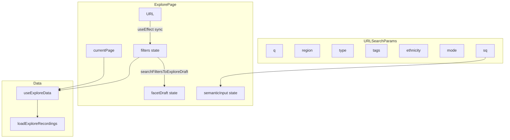

# VietTune — Explore, Knowledge Graph & AI Chat: tài liệu mã chi tiết

Tài liệu gồm ba khối:

1. **Khám phá (`/explore`)** — URL, state, `loadExploreRecordings`, filter/facet, UI kết quả, test.  
2. **Knowledge Graph** — API backend `api/KnowledgeGraph/*` **và** đồ thị **tính phía client** trong Cổng nghiên cứu (khác với trang Explore).  
3. **AI Chat (`/chatbot`)** — hội thoại QA, lưu tin nhắn, gọi backend Chat + citations.

**Mục lục — Explore**

1. [Tổng quan kiến trúc](#1-tổng-quan-kiến-trúc)
2. [Router và entry](#2-router-và-entry)
3. [URL ↔ `SearchFilters` ↔ UI](#3-url--searchfilters--ui)
4. [`ExplorePage` — state, effect, handler](#4-explorepage--state-effect-handler)
5. [`useExploreData`](#5-useexploredata)
6. [`loadExploreRecordings` — toàn bộ mã](#6-loadexplorerecordings--toàn-bộ-mã)
7. [`applyGuestFilters`](#7-applyguestfilters)
8. [`exploreFacetDraft`](#8-explorefacetdraft)
9. [`exploreSemanticRank`](#9-exploresemanticrank)
10. [`EXPLORE_FILTER_OPTIONS` và `FilterSidebar`](#10-explore_filter_options-và-filtersidebar)
11. [`ExploreSearchHeader`](#11-exploresearchheader)
12. [`ExploreResultRow`](#12-exploreresultrow)
13. [Dịch vụ & hằng số liên quan (Explore)](#13-dịch-vụ--hằng-số-liên-quan)
14. [Test (Explore)](#14-test)

**Mục lục — Knowledge Graph & AI Chat**

15. [Knowledge Graph (API backend + đồ thị Researcher)](#15-knowledge-graph-api-backend--đồ-thị-researcher)
16. [AI Chat (Chatbot)](#16-ai-chat-chatbot)
17. [File index (tổng hợp)](#17-file-index-tổng-hợp)

---

## 1. Tổng quan kiến trúc

**Nguyên tắc Phase 5:** URL là **nguồn sự thật** cho trạng thái đã áp dụng (`filters`, `mode`, `sq`). Sidebar giữ **bản nháp** (`facetDraft`) cho đến khi người dùng bấm **Áp dụng**. Ô tìm theo ngữ nghĩa trong header có **debounce 600ms** để đồng bộ `sq` lên URL khi đang ở chế độ semantic.



---

## 2. Router và entry

**File:** `src/App.tsx`

- `ExplorePage` được `lazy(() => import('./pages/ExplorePage'))`.
- Route: `<Route path="explore" element={<RouteSuspense><ExplorePage /></RouteSuspense>} />` nằm trong layout có path `/` (MainLayout), nên URL người dùng là **`/explore`**.

Không có guard đăng nhập: trang public; hành vi dữ liệu phân nhánh theo `useAuth().isAuthenticated` bên trong hook load.

---

## 3. URL ↔ `SearchFilters` ↔ UI

### 3.1. Đọc URL → `SearchFilters`

**File:** `src/pages/ExplorePage.tsx` — hàm `filtersFromSearchParams`

| Tham số URL | Trường `SearchFilters` | Ghi chú |
|-------------|------------------------|---------|
| `q` | `query` | `trim()` |
| `region` | `regions: [region]` | Chỉ khi giá trị thuộc enum `Region` |
| `type` | `recordingTypes` | Chuỗi comma; mỗi phần phải là `RecordingType` hợp lệ |
| `status` | `verificationStatus: [status]` | Phải thuộc `VerificationStatus` |
| `from` / `to` | `dateFrom` / `dateTo` | Chuỗi nguyên văn từ URL |
| `tags` | `tags` | Split comma, trim |
| `ethnicity` | `ethnicityIds` | Split comma, trim |

**Mã đầy đủ:**

```typescript
function filtersFromSearchParams(searchParams: URLSearchParams): SearchFilters {
  const q = searchParams.get('q')?.trim();
  const region = searchParams.get('region');
  const typeParam = searchParams.get('type');
  const status = searchParams.get('status');
  const from = searchParams.get('from');
  const to = searchParams.get('to');
  const tagsParam = searchParams.get('tags');
  const ethnicityParam = searchParams.get('ethnicity');
  const filters: SearchFilters = {};
  if (q) filters.query = q;
  if (region && Object.values(Region).includes(region as Region))
    filters.regions = [region as Region];
  if (typeParam) {
    const parts = typeParam
      .split(',')
      .map((t) => t.trim())
      .filter(Boolean);
    const valid = parts.filter((p): p is RecordingType =>
      Object.values(RecordingType).includes(p as RecordingType),
    );
    if (valid.length) filters.recordingTypes = valid;
  }
  if (status && Object.values(VerificationStatus).includes(status as VerificationStatus))
    filters.verificationStatus = [status as VerificationStatus];
  if (from) filters.dateFrom = from;
  if (to) filters.dateTo = to;
  if (tagsParam)
    filters.tags = tagsParam
      .split(',')
      .map((t) => t.trim())
      .filter(Boolean);
  if (ethnicityParam) {
    filters.ethnicityIds = ethnicityParam
      .split(',')
      .map((t) => t.trim())
      .filter(Boolean);
  }
  return filters;
}
```

### 3.2. `SearchFilters` → query string (record)

```typescript
function searchParamsFromFilters(filters: SearchFilters): Record<string, string> {
  const params: Record<string, string> = {};
  if (filters.query) params.q = filters.query;
  if (filters.regions?.length) params.region = filters.regions[0];
  if (filters.recordingTypes?.length) params.type = filters.recordingTypes.join(',');
  if (filters.verificationStatus?.length) params.status = filters.verificationStatus[0];
  if (filters.dateFrom) params.from = filters.dateFrom;
  if (filters.dateTo) params.to = filters.dateTo;
  if (filters.tags?.length) params.tags = filters.tags.join(',');
  if (filters.ethnicityIds?.length) params.ethnicity = filters.ethnicityIds.join(',');
  return params;
}
```

**Lưu ý:** Chỉ **một** `region` và **một** `status` được ghi lên URL (phần tử đầu mảng).

### 3.3. Ghép mode semantic + `sq`

```typescript
function buildExploreSearchParams(
  filters: SearchFilters,
  mode: ExploreSearchMode,
  semanticSq: string,
): URLSearchParams {
  const base = searchParamsFromFilters(filters);
  const p = new URLSearchParams();
  Object.entries(base).forEach(([k, v]) => p.set(k, v));
  if (mode === 'semantic') p.set('mode', 'semantic');
  else p.delete('mode');
  const sem = semanticSq.trim();
  if (sem) p.set('sq', sem);
  else p.delete('sq');
  return p;
}
```

### 3.4. Chế độ tìm kiếm

- `searchParams.get('mode') === 'semantic'` → `exploreMode = 'semantic'`.
- Ngược lại → `'keyword'`.
- Chuỗi semantic **đã áp dụng** lấy từ `searchParams.get('sq') ?? ''` (biến `sqFromUrl` trong page), không nhất thiết bằng ký tự đang gõ trong ô (`semanticInput`) cho đến khi debounce/commit.

---

## 4. `ExplorePage` — state, effect, handler

**Hằng số:** `EXPLORE_PAGE_SIZE = 20` — dùng cho `totalPages = ceil(totalResults / 20)` trên UI; logic slice bên loader cũng dùng 20 ở nhiều nhánh.

### 4.1. Bảng state

| State / derived | Kiểu / nguồn | Vai trò |
|-----------------|--------------|---------|
| `searchParams` | `URLSearchParams` (RRD) | Nguồn URL |
| `filters` | `SearchFilters` | Đã commit; đồng bộ từ URL |
| `currentPage` | `number` | Phân trang (một số nhánh guest/semantic coi như 1 trang dữ liệu đã lọc) |
| `filterDrawerOpen` | `boolean` | Drawer bộ lọc mobile |
| `facetDraft` | `ExploreFacetDraft` | Bản nháp sidebar; map từ `filters` khi URL đổi |
| `sqFromUrl` | `string` | `searchParams.get('sq') ?? ''` |
| `semanticInput` | `string` | Ô nhập; sync từ `sqFromUrl` khi URL đổi |
| `debouncedSemanticInput` | `string` | `useDebounce(semanticInput, 600)` |
| `exploreMode` | `'keyword' \| 'semantic'` | Từ `mode` trên URL |
| `returnTo` | `string` | `pathname + search` — truyền xuống `ExploreResultRow` để quay lại |
| `deferredRecordings` | `Recording[]` | `useDeferredValue(recordings)` — giảm block khi list đổi |

### 4.2. Effects (thứ tự ý nghĩa)

| Effect | Dependency | Hành vi |
|--------|------------|---------|
| Sync ô semantic | `[sqFromUrl]` | `setSemanticInput(sqFromUrl)` |
| Escape đóng drawer | `[filterDrawerOpen, closeFilterDrawer]` | `keydown` → Escape |
| Focus nút đóng drawer | `[filterDrawerOpen, isNarrowViewport]` | RAF focus ref đóng |
| Desktop đóng drawer | `[]` | `matchMedia(min-width: 1024px)` → `setFilterDrawerOpen(false)` |
| Khóa scroll body | `[filterDrawerOpen]` | Khi drawer mở trên hẹp: `overflow: hidden` |
| Debounce → URL | `[debouncedSemanticInput, exploreMode, sqFromUrl, filters, setSearchParams]` | Nếu `semantic` và debounced ≠ `sqFromUrl` và (debounced không rỗng hoặc sq cũ không rỗng): `setSearchParams(buildExploreSearchParams(..., semantic, debounced))`, xóa `query` khỏi bản copy `filters`, `setCurrentPage(1)` |
| URL → filters | `[searchParams]` | `setFilters(filtersFromSearchParams)`; `setCurrentPage(1)` |
| Scroll kết quả | `[currentPage]` | Nếu `currentPage > 1`: scroll tới `resultsTopRef` |
| filters → facetDraft | `[filters]` | `setFacetDraft(searchFiltersToExploreDraft(filters, EXPLORE_FILTER_OPTIONS))` |

### 4.3. Handlers

| Handler | Mô tả |
|---------|--------|
| `handleSearch(newFilters)` | `setFilters`, `setCurrentPage(1)`, `setSearchParams(buildExploreSearchParams(newFilters, mode từ URL hiện tại, sq hiện tại))` |
| `handleFilterSearch` | `handleSearch` + `setFilterDrawerOpen(false)` |
| `submitKeywordSearch` | `exploreDraftToSearchFilters(facetDraft)` → URL với `mode=keyword`, `sq` xóa |
| `submitSemanticSearch` | Copy `filters`, xóa `query`, URL `semantic` + `sq = semanticInput` |
| `onExploreModeChange(m)` | `setCurrentPage(1)`; URL với `filters` hiện tại + `semanticInput` |
| `clearAllExplore` | `createEmptyExploreFacetDraft`, `setSemanticInput('')`, `setSearchError(null)`, `setSearchParams({}, { replace: true })` |
| `handleFacetApply` | `exploreDraftToSearchFilters(facetDraft)`; nếu semantic thì `delete next.query`; `handleFilterSearch(next)`; mobile: đóng drawer + focus trigger |
| `handleFacetReset` | `clearAllExplore` + đóng drawer + focus |

### 4.4. Layout UI (tóm tắt cấu trúc DOM)

1. Header: tiêu đề + `BackButton`.
2. **Mobile:** nút “Bộ lọc” (`filterBadgeActive` = có key trong `filters` hoặc `sq` khác rỗng).
3. Overlay click-to-close khi drawer mở.
4. **Grid `lg`:** `aside` (sticky) chứa `FilterSidebar`; `main` chứa `ExploreSearchHeader` + panel kết quả.
5. **Aside mobile:** fixed phải, translate, `role="dialog"` khi hẹp + mở; `aria-hidden` khi đóng trên hẹp.
6. Kết quả: `searchError` (amber), spinner, empty state có copy theo `exploreMode` / `hasFilters` / `hasSemanticQuery`, list `ExploreResultRow`, nút Trang trước/sau khi `totalPages > 1`.

---

## 5. `useExploreData`

**File:** `src/hooks/useExploreData.ts`

- Mỗi lần `currentPage`, `exploreMode`, `filters`, `isAuthenticated`, `sqFromUrl` đổi: tạo `AbortController`, `setLoading(true)`, gọi `loadExploreRecordings`, cập nhật state, `setLoading(false)` trong `finally` (trừ khi `cancelled`).
- **DEV telemetry:** `console.warn('[ExplorePage]', { source, count, filters, ... })` khi `import.meta.env.DEV`.
- Lỗi không abort: `searchError` cố định tiếng Việt; `isExploreRequestAborted` thì không ghi đè state lỗi.

**Mã đầy đủ:**

```typescript
import { useEffect, useState } from 'react';

import type { ExploreSearchMode } from '@/components/features/ExploreSearchHeader';
import {
  loadExploreRecordings,
  isExploreRequestAborted,
  type ExploreDataSource,
} from '@/features/explore/utils/exploreRecordingsLoad';
import type { Recording } from '@/types';
import type { SearchFilters } from '@/types';

type Params = {
  currentPage: number;
  exploreMode: ExploreSearchMode;
  filters: SearchFilters;
  sqFromUrl: string;
  isAuthenticated: boolean;
};

export function useExploreData({
  currentPage,
  exploreMode,
  filters,
  sqFromUrl,
  isAuthenticated,
}: Params) {
  const [recordings, setRecordings] = useState<Recording[]>([]);
  const [loading, setLoading] = useState(false);
  const [totalResults, setTotalResults] = useState(0);
  const [searchError, setSearchError] = useState<string | null>(null);

  useEffect(() => {
    const controller = new AbortController();
    let cancelled = false;

    const logExploreTelemetry = (
      source: ExploreDataSource,
      count: number,
      extra?: Record<string, unknown>,
    ) => {
      if (!import.meta.env.DEV) return;
      console.warn('[ExplorePage]', {
        source,
        count,
        isAuthenticated,
        page: currentPage,
        filters,
        exploreMode,
        semanticQ: sqFromUrl,
        ...extra,
      });
    };

    void (async () => {
      setLoading(true);
      setSearchError(null);
      try {
        const r = await loadExploreRecordings({
          signal: controller.signal,
          currentPage,
          exploreMode,
          filters,
          sqActive: sqFromUrl.trim(),
          isAuthenticated,
        });
        if (cancelled || controller.signal.aborted) return;
        setRecordings(r.recordings);
        setTotalResults(r.totalResults);
        setSearchError(r.fetchWarning ?? null);
        logExploreTelemetry(r.dataSource, r.recordings.length, {
          ...(r.fetchWarning ? { fallback: true } : {}),
        });
      } catch (e) {
        if (cancelled || controller.signal.aborted || isExploreRequestAborted(e)) return;
        console.error('Explore load failed:', e);
        setRecordings([]);
        setTotalResults(0);
        setSearchError('Không tải được dữ liệu. Bạn có thể thử lại sau.');
        logExploreTelemetry('empty', 0, { failed: true });
      } finally {
        if (!cancelled) setLoading(false);
      }
    })();

    return () => {
      cancelled = true;
      controller.abort();
    };
  }, [currentPage, exploreMode, filters, isAuthenticated, sqFromUrl]);

  return { recordings, loading, totalResults, searchError, setSearchError };
}
```

**Ghi chú type `ExploreDataSource`:** union khai báo cả `'archiveFallback' | 'semanticLocal'` nhưng phần gán `dataSource` cuối hàm `loadExploreRecordings` hiện chỉ dùng `'recordingGuest' | 'recordingApi' | 'searchApi' | 'empty'`.

---

## 6. `loadExploreRecordings` — toàn bộ mã

**File:** `src/features/explore/utils/exploreRecordingsLoad.ts`

Ý tưởng:

- `facetOnly = { ...filters }`; nếu `exploreMode === 'semantic'` thì **bỏ `query`** khỏi facet-only (từ khóa keyword không dùng song song với semantic trong nhánh semantic).
- **Semantic + `sqActive`:** gọi `semanticSearchService.searchSemantic({ q, topK: 10 })`; gắn `_semanticScore`; nếu chưa đăng nhập **hoặc** còn key facet → `applyGuestFilters`; một trang, `total = length`. Lỗi semantic → `fetchFullCatalog` + lọc client với `query: sqActive` (tức dùng query để lọc chuỗi mô tả trên catalog) + `fetchWarning`.
- **Guest:** `getGuestRecordings(page, 20)` → lọc `applyGuestFilters` với `activeFilters` = semantic ? `facetOnly` : `filters`; luôn `totalPages: 1` sau lọc (toàn bộ kết quả lọc là một “pool”).
- **Auth + có filter:** `searchRecordings`; nếu rỗng nhưng có `query` thì thử catalog + client filter + slice phân trang 20.
- **Auth + không filter:** `fetchFullCatalog` → sort `uploadedDate` giảm dần → slice theo `currentPage`.
- **Catch tổng:** catalog + fallback slice; guest thì vẫn `applyGuestFilters`; `sliceLen` = full length nếu semantic+có sq, ngược lại 20.

**Mã nguồn đầy đủ (khớp repo):**

```typescript
import type { ExploreSearchMode } from '@/components/features/ExploreSearchHeader';
import { applyGuestFilters } from '@/features/explore/utils/exploreGuestFilters';
import { recordingService } from '@/services/recordingService';
import { fetchVerifiedSubmissionsAsRecordings } from '@/services/researcherArchiveService';
import { fetchRecordingsSearchByFilter } from '@/services/researcherRecordingFilterSearch';
import { semanticSearchService } from '@/services/semanticSearchService';
import type { Recording, SearchFilters } from '@/types';

export type ExploreDataSource =
  | 'recordingGuest'
  | 'recordingApi'
  | 'searchApi'
  | 'archiveFallback'
  | 'semanticLocal'
  | 'empty';

type ApiResponseType = { items: Recording[]; total: number; totalPages: number };

function asApiResponse(value: unknown): ApiResponseType {
  if (!value || typeof value !== 'object') {
    return { items: [], total: 0, totalPages: 1 };
  }
  const root = value as Record<string, unknown>;
  const items = Array.isArray(root.items) ? (root.items as Recording[]) : [];
  const total = typeof root.total === 'number' ? root.total : items.length;
  const totalPages = typeof root.totalPages === 'number' ? root.totalPages : 1;
  return { items, total, totalPages };
}

export function isExploreRequestAborted(e: unknown): boolean {
  if (e && typeof e === 'object') {
    const name = (e as { name?: string }).name;
    if (name === 'AbortError' || name === 'CanceledError') return true;
    const code = (e as { code?: string }).code;
    if (code === 'ERR_CANCELED') return true;
  }
  return false;
}

export type ExploreLoadInput = {
  signal?: AbortSignal;
  currentPage: number;
  exploreMode: ExploreSearchMode;
  filters: SearchFilters;
  sqActive: string;
  isAuthenticated: boolean;
};

export type ExploreLoadSuccess = {
  recordings: Recording[];
  totalResults: number;
  dataSource: ExploreDataSource;
  /** Set when primary API failed but archive fallback (or empty) was used. */
  fetchWarning?: string;
};

function sortByUploadedDesc(items: Recording[]): Recording[] {
  return [...items].sort(
    (a, b) => new Date(b.uploadedDate).getTime() - new Date(a.uploadedDate).getTime(),
  );
}

async function fetchApprovedLocalFallback(): Promise<Recording[]> {
  try {
    const { getLocalRecordingMetaList, getLocalRecordingFull } = await import('@/services/recordingStorage');
    const { migrateVideoDataToVideoData } = await import('@/utils/helpers');
    const { convertLocalToRecording } = await import('@/utils/localRecordingToRecording');
    const { ModerationStatus } = await import('@/types');

    const meta = await getLocalRecordingMetaList();
    const migrated = migrateVideoDataToVideoData(meta as import('@/types').LocalRecording[]);
    const approved = migrated.filter(
      (r) =>
        r.moderation &&
        typeof r.moderation === 'object' &&
        'status' in r.moderation &&
        (r.moderation as { status?: string }).status === ModerationStatus.APPROVED,
    );
    const fullItems = await Promise.all(approved.map((r) => getLocalRecordingFull(r.id ?? '')));
    const locals = fullItems.filter((r): r is import('@/types').LocalRecording => r != null);
    return Promise.all(locals.map((r) => convertLocalToRecording(r)));
  } catch {
    return [];
  }
}

async function fetchFullCatalog(signal?: AbortSignal): Promise<Recording[]> {
  let pool: Recording[] = [];
  try {
    pool = await fetchVerifiedSubmissionsAsRecordings({ signal });
  } catch { /* backend may 500 — continue */ }
  if (pool.length === 0) {
    try {
      pool = await fetchRecordingsSearchByFilter({ page: 1, pageSize: 500 });
    } catch { /* continue */ }
  }
  if (pool.length === 0) {
    pool = await fetchApprovedLocalFallback();
  }
  return pool;
}

export async function loadExploreRecordings(input: ExploreLoadInput): Promise<ExploreLoadSuccess> {
  const { signal, currentPage, exploreMode, filters, sqActive, isAuthenticated } = input;
  const apiOpts = { signal };

  const facetOnly: SearchFilters = { ...filters };
  if (exploreMode === 'semantic') delete facetOnly.query;

  let response: ApiResponseType;
  let fetchWarning: string | undefined;

  try {
    if (exploreMode === 'semantic' && sqActive) {
      try {
        const semanticResponse = await semanticSearchService.searchSemantic({
          q: sqActive,
          topK: 10,
        });
        const ranked = semanticResponse.map((r) => ({
          ...r.recording,
          _semanticScore: r.similarityScore,
        }));
        const needFacet = !isAuthenticated || Object.keys(facetOnly).length > 0;
        const pooled = needFacet ? applyGuestFilters(ranked, facetOnly) : ranked;
        response = { items: pooled, total: pooled.length, totalPages: 1 };
      } catch (semErr) {
        if (isExploreRequestAborted(semErr)) throw semErr;
        const catalog = await fetchFullCatalog(signal);
        const clientFiltered = applyGuestFilters(catalog, { ...facetOnly, query: sqActive });
        response = { items: clientFiltered, total: clientFiltered.length, totalPages: 1 };
        if (clientFiltered.length > 0) {
          fetchWarning = 'Tìm ngữ nghĩa tạm lỗi — hiển thị kết quả từ kho dữ liệu.';
        } else {
          fetchWarning = 'Hệ thống tìm kiếm ngữ nghĩa tạm thời không khả dụng.';
        }
      }
    } else if (!isAuthenticated) {
      const guestRes = await recordingService.getGuestRecordings(currentPage, 20, apiOpts);
      const activeFilters = exploreMode === 'semantic' ? facetOnly : filters;
      const filteredGuestItems = applyGuestFilters(
        Array.isArray(guestRes?.items) ? guestRes.items : [],
        activeFilters,
      );
      response = {
        items: filteredGuestItems,
        total: filteredGuestItems.length,
        totalPages: 1,
      };
    } else if (Object.keys(exploreMode === 'semantic' ? facetOnly : filters).length > 0) {
      const activeFilters = exploreMode === 'semantic' ? facetOnly : filters;
      const res = await recordingService.searchRecordings(activeFilters, currentPage, 20, apiOpts);
      response = asApiResponse(res);

      if (response.items.length === 0 && activeFilters.query) {
        try {
          const catalog = await fetchFullCatalog(signal);
          const clientFiltered = applyGuestFilters(catalog, activeFilters);
          if (clientFiltered.length > 0) {
            const pageSize = 20;
            const start = Math.max(0, (currentPage - 1) * pageSize);
            const paged = clientFiltered.slice(start, start + pageSize);
            response = {
              items: paged,
              total: clientFiltered.length,
              totalPages: Math.max(1, Math.ceil(clientFiltered.length / pageSize)),
            };
          }
        } catch {
          /* keep original empty response */
        }
      }
    } else {
      const verified = await fetchFullCatalog(signal);
      const sorted = sortByUploadedDesc(verified);
      const pageSize = 20;
      const start = Math.max(0, (currentPage - 1) * pageSize);
      const items = sorted.slice(start, start + pageSize);
      response = {
        items,
        total: sorted.length,
        totalPages: Math.max(1, Math.ceil(sorted.length / pageSize)),
      };
    }
  } catch (error) {
    if (isExploreRequestAborted(error)) throw error;
    try {
      const catalog = await fetchFullCatalog(signal);
      if (signal?.aborted) throw error;
      const activeFilters = exploreMode === 'semantic' ? facetOnly : filters;
      const filteredFallback = !isAuthenticated
        ? applyGuestFilters(catalog, activeFilters)
        : catalog;
      const sorted = sortByUploadedDesc(filteredFallback);
      const sliceLen = exploreMode === 'semantic' && sqActive ? sorted.length : 20;
      response = {
        items: sorted.slice(0, sliceLen),
        total: sorted.length,
        totalPages: Math.max(1, Math.ceil(sorted.length / Math.max(sliceLen, 1))),
      };
      if (sorted.length === 0) {
        fetchWarning = 'Không tải được dữ liệu. Bạn có thể thử lại sau.';
      }
    } catch (inner) {
      if (isExploreRequestAborted(inner)) throw inner;
      return {
        recordings: [],
        totalResults: 0,
        dataSource: 'empty',
        fetchWarning: 'Không tải được dữ liệu. Bạn có thể thử lại sau.',
      };
    }
  }

  const apiItems = Array.isArray(response?.items) ? response.items : [];
  const apiTotal = typeof response?.total === 'number' ? response.total : apiItems.length;
  const hasActiveFilters = Object.keys(exploreMode === 'semantic' ? facetOnly : filters).length > 0;
  let dataSource: ExploreDataSource = 'empty';

  if (exploreMode === 'semantic' && sqActive) {
    dataSource = apiItems.length > 0 ? 'searchApi' : 'empty';
  } else if (!isAuthenticated) {
    dataSource = apiItems.length > 0 ? 'recordingGuest' : 'empty';
  } else if (hasActiveFilters) {
    dataSource = apiItems.length > 0 ? 'searchApi' : 'empty';
  } else {
    dataSource = apiItems.length > 0 ? 'recordingApi' : 'empty';
  }

  return {
    recordings: sortByUploadedDesc(apiItems),
    totalResults: apiTotal,
    dataSource,
    fetchWarning,
  };
}
```

---

## 7. `applyGuestFilters`

**File:** `src/features/explore/utils/exploreGuestFilters.ts`

Lọc **chuỗi đã chuẩn hóa** (`normalizeSearchText`): query khớp substring trên khối title/desc/tags/instruments/ethnicity/performers; region/types/ethnicityIds/tags (mỗi tag phải có trong `recordingFacetHaystack`); ngày trên `recordedDate` hoặc `uploadedDate`.

```typescript
import { recordingFacetHaystack } from '@/features/explore/utils/exploreFacetDraft';
import type { Recording, SearchFilters } from '@/types';
import { normalizeSearchText } from '@/utils/searchText';

/** Client-side facet + keyword filter for guest catalog rows. */
export function applyGuestFilters(rows: Recording[], filters: SearchFilters): Recording[] {
  const query = normalizeSearchText(filters.query ?? '');
  const selectedRegions = filters.regions ?? [];
  const selectedTypes = filters.recordingTypes ?? [];
  const dateFrom = filters.dateFrom ? new Date(filters.dateFrom).getTime() : null;
  const dateTo = filters.dateTo ? new Date(filters.dateTo).getTime() : null;
  const tags = (filters.tags ?? []).map((t) => normalizeSearchText(t)).filter(Boolean);
  const ethnicityIds = filters.ethnicityIds ?? [];

  return rows.filter((r) => {
    if (query) {
      const title = normalizeSearchText(`${r.title ?? ''} ${r.titleVietnamese ?? ''}`);
      const desc = normalizeSearchText(r.description ?? '');
      const tagText = normalizeSearchText((r.tags ?? []).join(' '));
      const instText = normalizeSearchText(
        (r.instruments ?? []).map((i) => `${i.name ?? ''} ${i.nameVietnamese ?? ''}`).join(' '),
      );
      const ethText = normalizeSearchText(
        `${r.ethnicity?.name ?? ''} ${r.ethnicity?.nameVietnamese ?? ''}`,
      );
      const perfText = normalizeSearchText(
        (r.performers ?? []).map((p) => `${p.name ?? ''} ${p.nameVietnamese ?? ''}`).join(' '),
      );
      const haystack = `${title} ${desc} ${tagText} ${instText} ${ethText} ${perfText}`;
      if (!haystack.includes(query)) return false;
    }
    if (selectedRegions.length > 0 && !selectedRegions.includes(r.region)) return false;
    if (selectedTypes.length > 0 && !selectedTypes.includes(r.recordingType)) return false;
    if (ethnicityIds.length > 0) {
      const ok = ethnicityIds.some(
        (id) =>
          id === r.ethnicity.id || id === r.ethnicity.name || id === r.ethnicity.nameVietnamese,
      );
      if (!ok) return false;
    }
    if (tags.length > 0) {
      const hay = recordingFacetHaystack(r);
      if (!tags.every((t) => hay.includes(t))) return false;
    }
    if (dateFrom || dateTo) {
      const ts = new Date(r.recordedDate || r.uploadedDate || 0).getTime();
      if (Number.isFinite(dateFrom) && ts < (dateFrom as number)) return false;
      if (Number.isFinite(dateTo) && ts > (dateTo as number)) return false;
    }
    return true;
  });
}
```

---

## 8. `exploreFacetDraft`

**File:** `src/features/explore/utils/exploreFacetDraft.ts`

- `exploreDraftToSearchFilters`: gộp `genreTags + instrumentTags + culturalTags` vào `tags`; `ethnicityIds` từ sidebar (id = nhãn dân tộc trong options) cũng được đưa vào `ethnicityIds` và **đồng thời** tên đó được thêm vào `tags` (để lọc text trên haystack).
- `searchFiltersToExploreDraft`: tách lại `tags` URL thành genre/instrument/cultural nếu khớp label trong `EXPLORE_FILTER_OPTIONS`; tag không khớp → `leftover` gộp vào `genreTags`; `ethnicityIds` = union `f.ethnicityIds` và tag trùng nhãn dân tộc trong options.

**Mã đầy đủ:**

```typescript
import type { ExploreFilterOptions } from '@/constants/exploreFilterOptions';
import type { Recording, SearchFilters } from '@/types';
import { Region, RecordingType } from '@/types';
import { normalizeSearchText } from '@/utils/searchText';

/** Draft facet state for Explore sidebar (applied -> `SearchFilters` on "Apply"). */
export type ExploreFacetDraft = {
  query: string;
  ethnicityIds: string[];
  recordingTypes: RecordingType[];
  region: Region | null;
  genreTags: string[];
  instrumentTags: string[];
  culturalTags: string[];
};

export function createEmptyExploreFacetDraft(): ExploreFacetDraft {
  return {
    query: '',
    ethnicityIds: [],
    recordingTypes: [],
    region: null,
    genreTags: [],
    instrumentTags: [],
    culturalTags: [],
  };
}

export function exploreDraftToSearchFilters(d: ExploreFacetDraft): SearchFilters {
  const facetTags = [...d.genreTags, ...d.instrumentTags, ...d.culturalTags];
  const ethnicityNames = d.ethnicityIds.filter(Boolean);
  const tags = [...facetTags, ...ethnicityNames];
  const out: SearchFilters = {};
  const q = d.query.trim();
  if (q) out.query = q;
  if (ethnicityNames.length) out.ethnicityIds = [...ethnicityNames];
  if (d.recordingTypes.length) out.recordingTypes = [...d.recordingTypes];
  if (d.region) out.regions = [d.region];
  if (tags.length) out.tags = tags;
  return out;
}

export function searchFiltersToExploreDraft(
  f: SearchFilters,
  opts: ExploreFilterOptions,
): ExploreFacetDraft {
  const genreSet = new Set(opts.genreTags.map((g) => g.label));
  const instrSet = new Set(opts.instruments.map((i) => i.label));
  const cultSet = new Set(opts.culturalContexts.map((c) => c.label));
  const ethnicityLabels = new Set(opts.ethnicities.map((e) => e.label));

  const rawTags = f.tags ?? [];
  const genreTags: string[] = [];
  const instrumentTags: string[] = [];
  const culturalTags: string[] = [];
  const extraEthnicity: string[] = [];
  const leftover: string[] = [];

  for (const t of rawTags) {
    if (genreSet.has(t)) genreTags.push(t);
    else if (instrSet.has(t)) instrumentTags.push(t);
    else if (cultSet.has(t)) culturalTags.push(t);
    else if (ethnicityLabels.has(t)) extraEthnicity.push(t);
    else leftover.push(t);
  }

  const baseEth = f.ethnicityIds ?? [];
  const ethnicityIds = [...new Set([...baseEth, ...extraEthnicity])];

  return {
    query: f.query ?? '',
    ethnicityIds,
    recordingTypes: f.recordingTypes ? [...f.recordingTypes] : [],
    region: f.regions?.[0] ?? null,
    genreTags: [...genreTags, ...leftover],
    instrumentTags,
    culturalTags,
  };
}

/** Tag + instrument-name haystack for guest filtering. */
export function recordingFacetHaystack(r: Recording): string {
  const tags = (r.tags ?? []).map((t) => normalizeSearchText(t)).join(' ');
  const inst = (r.instruments ?? [])
    .map((i) => normalizeSearchText(`${i.name ?? ''} ${i.nameVietnamese ?? ''}`))
    .join(' ');
  return normalizeSearchText(`${tags} ${inst}`);
}
```

---

## 9. `exploreSemanticRank`

**File:** `src/features/explore/utils/exploreSemanticRank.ts`

Dùng cho **xếp hạng token overlap** phía client (cùng tinh thần với `SemanticSearchPage`); **không** phải đường chính của Explore khi API semantic còn sống (Explore gọi `semanticSearchService` trước).

```typescript
import type { Recording } from '@/types';

/** Tokenize for loose accent-insensitive matching (aligned with SemanticSearchPage). */
export function tokenizeExploreSemantic(text: string): string[] {
  return text
    .toLowerCase()
    .normalize('NFD')
    .replace(/\p{Diacritic}/gu, '')
    .split(/\s+/)
    .filter(Boolean);
}

export function scoreRecordingSemantic(r: Recording, tokens: string[]): number {
  const title = (r.title || '') + ' ' + (r.titleVietnamese || '');
  const desc = r.description || '';
  const ethnicityName =
    typeof r.ethnicity === 'object' && r.ethnicity !== null
      ? (r.ethnicity.name || '') + ' ' + (r.ethnicity.nameVietnamese || '')
      : '';
  const tags = (r.tags || []).join(' ');
  const instruments = (r.instruments ?? [])
    .map((i) => `${i.name ?? ''} ${i.nameVietnamese ?? ''}`)
    .join(' ');
  const searchable = [title, desc, ethnicityName, tags, instruments]
    .join(' ')
    .toLowerCase()
    .normalize('NFD')
    .replace(/\p{Diacritic}/gu, '');
  let score = 0;
  for (const t of tokens) {
    if (searchable.includes(t)) score += 1;
  }
  return score;
}

/** Rank by semantic token overlap; drops zero-score rows (same contract as SemanticSearchPage). */
export function rankRecordingsBySemanticQuery(
  recordings: Recording[],
  rawQuery: string,
): Recording[] {
  const trimmed = rawQuery.trim();
  if (!trimmed) return recordings;
  const tokens = tokenizeExploreSemantic(trimmed);
  if (tokens.length === 0) return recordings;
  return recordings
    .map((r) => ({ r, score: scoreRecordingSemantic(r, tokens) }))
    .filter((x) => x.score > 0)
    .sort((a, b) => b.score - a.score)
    .map((x) => x.r);
}
```

**Import:** ưu tiên `@/features/explore/utils/exploreSemanticRank`. Trong repo có thể còn file re-export dưới `src/utils/exploreSemanticRank.ts` — không nên thêm import mới vào đó nếu eslint chặn.

---

## 10. `EXPLORE_FILTER_OPTIONS` và `FilterSidebar`

**File:** `src/constants/exploreFilterOptions.ts`

- `ExploreFilterOptions`: `{ ethnicities, recordingTypes, genreTags, instruments, regions, culturalContexts }` — mỗi mục `{ id, label }` hoặc `{ value, label }` (recording type / region dùng `value` enum).
- `GENRES`, `ETHNICITIES`, `EVENT_TYPES` là mảng const; `INSTRUMENTS_SUBSET` là subset cố định (comment: align SearchBar).
- `EXPLORE_FILTER_OPTIONS`: map sang `{ id, label }` / `{ value: RecordingType|Region, label }`.

**File:** `src/components/features/FilterSidebar.tsx`

- **Nội bộ:** `SearchableCheckboxList` (lọc local theo ô search nhỏ), `AccordionSection` (`<details>`), `toggleString` / `toggleRecordingType`.
- **Nhóm:** Dân tộc (checkbox id), Thể loại ghi âm, Dòng nhạc (genre tags), Nhạc cụ (subset), Khu vực (`<select>` `Region`), Bối cảnh văn hóa.
- **Chân:** nút **Áp dụng** → `onApply`; **Xóa bộ lọc** → `onReset`.
- Export: `memo(FilterSidebar)`.

---

## 11. `ExploreSearchHeader`

**File:** `src/components/features/ExploreSearchHeader.tsx` (~242 dòng)

- **Tabs** `role="tablist"`: Keyword / Semantic — `aria-selected`, `tabIndex` roving, `aria-controls` trỏ tới panel.
- **Bàn phím:** ArrowLeft/ArrowRight chuyển tab + focus; Home → keyword; End → semantic.
- **Keyword panel:** `input type="search"` bind `keywordValue`; Enter hoặc nút “Tìm” → `onKeywordSubmit`; nút disabled khi `keywordBusy`.
- **Semantic panel:** luôn render (ẩn bằng `hidden` khi không phải semantic và không phải `home-semantic-only`); `semanticValue`; Enter / “Tìm”; disabled khi `semanticBusy` hoặc không có trim.
- **`layout="home-semantic-only"`** (HomePage): ẩn tab keyword, ẩn link `/semantic-search`, chỉ panel semantic; `role="tabpanel"` có thể bỏ tùy layout.

`keywordBusy` / `semanticBusy` trên Explore: `loading && exploreMode === 'keyword'|'semantic'`.

---

## 12. `ExploreResultRow`

**File:** `src/components/features/ExploreResultRow.tsx`

- **Named export:** `export const ExploreResultRow = memo(function ExploreResultRow({ ... }) { ... })`
- **Default export:** `export default ExploreResultRow` (cùng component).
- **Helpers:** `getEthnicityLabel`, `getRegionLabel` (ưu tiên extra string keys, sau đó `REGION_NAMES`), `getInstrumentLabel`, `getCeremonyLabel`, `getCommuneLabel` — đọc linh hoạt từ `Recording` + loose keys.
- **Metadata hiển thị:** tối đa 5 cặp label/value; nếu không có dữ liệu thì placeholder “Chưa cập nhật”; badge “Thiếu metadata” khi thiếu; responsive ẩn chip sau thứ 3 trên mobile (`+N thêm`).
- **Điều hướng:** `navigate(\`/recordings/${r.id}\`, { state: { from: returnTo, preloadedRecording: r } })` cho cả nút Phát và Chi tiết.
- **Verified:** badge “Đã xác minh” nếu `verificationStatus === VerificationStatus.VERIFIED`.

---

## 13. Dịch vụ & hằng số liên quan

| Module | Vai trò trong Explore |
|--------|----------------------|
| `recordingService.getGuestRecordings(page, 20, { signal })` | Pool guest trước khi lọc client |
| `recordingService.searchRecordings(filters, page, 20, { signal })` | Tìm server khi đã auth + có filter |
| `semanticSearchService.searchSemantic({ q, topK: 10 })` | Semantic chính |
| `fetchVerifiedSubmissionsAsRecordings` | Bước 1 catalog đầy đủ |
| `fetchRecordingsSearchByFilter({ page: 1, pageSize: 500 })` | Bước 2 catalog |
| Dynamic `recordingStorage` + `convertLocalToRecording` | Bước 3 offline approved |

**Types:** `SearchFilters`, `Recording`, `Region`, `RecordingType`, `VerificationStatus` từ `@/types`.

**Khác:** `UploadFormFields` / `HomePage` không thuộc core Explore nhưng có thể dùng `ExploreSearchHeader` hoặc link `/explore`.

---

## 14. Test

| File | Nội dung |
|------|----------|
| `src/hooks/useExploreData.test.tsx` | Mock `loadExploreRecordings` + `isExploreRequestAborted`: success, throw → error message, abort → không lỗi |
| `tests/e2e/05-explore.spec.ts` | Smoke |
| `tests/e2e/14-explore-full.spec.ts` | Rộng hơn |
| `tests/e2e/07-upload-explore-ui.spec.ts` | Upload ↔ explore UI |
| `tests/e2e/08-contributions-explore-ui.spec.ts` | Contributions ↔ explore |

---

## 15. Knowledge Graph (API backend + đồ thị Researcher)

### 15.1. Hai ý nghĩa khác nhau của “Knowledge Graph” trong VietTune

| Khía cạnh | Mô tả |
|-----------|--------|
| **A. API backend** (`IKnowledgeGraphService` / Neo4j hoặc tầng persistence tương đương) | REST dưới prefix **`/api/KnowledgeGraph/`**. Dùng cho **subgraph**, **search node**, **overview**, **stats**, **relationship**. Client có thể gọi qua OpenAPI / `generated.d.ts` — **hiện không thấy** service TS riêng bọc toàn bộ endpoint này trong `src/services/` (chủ yếu khai báo trong swagger). |
| **B. Đồ thị trong UI Researcher** | Dữ liệu **`nodes` + `links`** được **tính toán hoàn toàn trên trình duyệt** từ danh sách bản thu phân tích + reference data (dân tộc, nhạc cụ, nghi lễ). Hook `useKnowledgeGraphData` → `buildKnowledgeGraphData`. **Không** gọi `POST /api/KnowledgeGraph/explore` trong luồng này. |

Trang **`/explore`** (mục 1–14) **không** dùng cả hai ở trên cho danh sách bản thu; chỉ có tên tham số `explore` trùng từ ngữ.

### 15.2. Backend — `KnowledgeGraphController`

**File:** `backend/VietTuneArchive/Controllers/KnowledgeGraphController.cs`  
**Route base:** `api/[controller]` → **`/api/KnowledgeGraph/...`**  
**Authorization:** các action được gắn `[AllowAnonymous]` trong snippet hiện tại.

| Method | Path | Tham số / body | Trả về (ý nghĩa) |
|--------|------|----------------|------------------|
| `POST` | `explore` | Body `GraphExploreRequest`: `NodeId`, `NodeType` (bắt buộc); `Depth` (1–3); `MaxNodes` (≤200); `FilterTypes` | Subgraph quanh một node |
| `GET` | `search` | `query` (bắt buộc), `types?`, `limit` (default 20) | Tìm node theo từ khóa |
| `GET` | `overview` | `maxNodes` (default 100) | Tổng quan graph |
| `GET` | `stats` | — | Thống kê |
| `GET` | `relationship` | `source`, `target` (bắt buộc), `limit` | Graph giữa hai loại entity |

**DTO explore:** `backend/VietTuneArchive.Application/Mapper/DTOs/KnowledgeGraph/GraphExploreRequest.cs` — `NodeId`, `NodeType`, `Depth`, `MaxNodes`, `FilterTypes`.

**Service triển khai:** `backend/VietTuneArchive.Application/Services/KnowledgeGraphService.cs`.

**Tài liệu / prompt API:** `backend/VietTuneArchive/Prompt/knowledge-graph-api-prompt.md` (mô tả contract, ví dụ curl `POST .../explore`).

**OpenAPI:** `src/api/generated.d.ts` — paths `/api/KnowledgeGraph/explore`, `search`, `overview`, `stats`, `relationship`.

### 15.3. Frontend — types đồ thị

**File:** `src/types/graph.ts`

- `GraphNodeType`: `'region' | 'ethnic_group' | 'ceremony' | 'instrument' | 'recording'`
- `GraphNode`: `id`, `name`, `type`, `val?`, `color?`, `imgUrl?`, `desc?`, `degree?` + các field runtime của thư viện force-graph (`x`, `y`, …)
- `GraphLink`: `source`, `target` (string hoặc node), `value?`, `color?`, `type?` (ví dụ `belongs_to`, `uses_instrument`)
- `KnowledgeGraphData`: `{ nodes, links }`

### 15.4. Frontend — `buildKnowledgeGraphData` / `useKnowledgeGraphData`

**File:** `src/features/knowledge-graph/hooks/useKnowledgeGraphData.ts`

- **Input:** `ResearcherAnalysisRecord[]`, `EthnicGroupItem[]`, `InstrumentItem[]`, `CeremonyItem[]`.
- **Logic (tóm tắt):** với mỗi recording tạo node `rec_{id}`; từ ethnicity → node `eth_*` + link `belongs_to`; region → `reg_*` + `located_in` (recording hoặc ethnic → region); ceremony → `cer_*` + `played_in` / `performs`; mỗi instrument → `inst_*` + `uses_instrument` / `instrument_of`.
- **Gộp node trùng `id`:** tăng `val` khi gặp lại cùng id.
- **Link:** tránh cạnh trùng vô hướng (kiểm tra cả `(s,t)` và `(t,s)`).
- **TODO trong code:** Phase 2 — chuyển tính toán nặng lên backend/Neo4j khi dataset lớn.

`useKnowledgeGraphData` chỉ là `useMemo(() => buildKnowledgeGraphData(...), [recordings, ethnicRefData, instrumentRefData, ceremonyRefData])`.

### 15.5. Frontend — `KnowledgeGraphViewer`

**File:** `src/features/knowledge-graph/components/KnowledgeGraphViewer.tsx`

- Props: `data: KnowledgeGraphData`, `onNodeClick?`.
- Render đồ thị lực (ví dụ react-force-graph / tương đương — xem import trong file).
- Export default component.

### 15.6. Nơi ghép vào UI

- **`ResearcherPortalPage`** (`src/pages/researcher/ResearcherPortalPage.tsx`): gọi `useKnowledgeGraphData(recordings, ...)` và truyền `graphData` xuống tab đồ thị.
- **`ResearcherPortalGraphTab`** (`src/components/researcher/ResearcherPortalGraphTab.tsx`): bọc `KnowledgeGraphViewer` (có thể hai layout: rộng / hẹp).

### 15.7. Admin Knowledge Base (không nhầm với KG API)

- **`KnowledgeBasePage`**, `knowledgeBaseApi.ts`, `KnowledgeBasePanel`**: quản trị mục KB (nội dung tri thức), **khác** với endpoint `KnowledgeGraph` phía trên, dù tên gần nhau.

---

## 16. AI Chat (Chatbot)

### 16.1. Route và trang

**File:** `src/App.tsx`

- `const ChatbotPage = lazy(() => import('./pages/ChatbotPage'));`
- `<Route path="chatbot" element={<RouteSuspense><ChatbotPage /></RouteSuspense>} />`  
→ URL: **`/chatbot`**.

**File:** `src/pages/ChatbotPage.tsx`

- Tiêu đề dùng `INTELLIGENCE_NAME` từ `@/config/constants`.
- **Tin chào** cố định (`WELCOME_MESSAGE`) đồng bộ với tab Hỏi Đáp AI trên `ResearcherPortalPage`.
- **Fallback** khi API lỗi / không có nội dung: `FALLBACK_REPLY`.

### 16.2. State chính

| State | Vai trò |
|-------|---------|
| `conversationId` | UUID; khởi tạo `crypto.randomUUID()`; đổi khi chọn hội thoại cũ / “chat mới” |
| `isFirstMessage` | Lần đầu gửi → tạo conversation + đặt `chatTitle` = nội dung tin user |
| `messages` | `Message[]` (`@/types/chat`: `id`, `role`, `content`, `timestamp`, optional sources / flag) |
| `input` / `isTyping` | Ô nhập + chờ bot |
| `isSidebarOpen` | Sidebar lịch sử (mobile có overlay nút History) |
| `isLoadingMessages` | Khi load tin theo conversation đã chọn |

### 16.3. Luồng gửi tin (`sendMessage`)

1. Thêm message user vào UI; `setIsTyping(true)`.
2. Nếu `isFirstMessage`: `createQAConversation({ id, userId, title, createdAt })`, `setIsFirstMessage(false)`, `loadHistory()`.
3. `createQAMessage` cho tin user (`role: 0`, `sourceRecordingIdsJson: '[]'`, …).
4. **`sendResearcherChatMessage(text)`** — gọi backend Chat (xem 16.4).
5. Lấy `reply.answer`, `reply.citations` → map `recordingId` + `title` → lưu assistant message UI + `createQAMessage` bot (`role: 1`, `sourceRecordingIdsJson` = JSON danh sách id trích dẫn).
6. `catch`: thêm assistant với `FALLBACK_REPLY`; `finally`: `setIsTyping(false)`.

**Phím:** Enter (không Shift) gửi tin.

**Chọn hội thoại cũ:** `fetchConversationMessages(conv.id)` → map `role === 0` → `'user'`, ngược lại `'assistant'`; hỗ trợ `sourceRecordingIdsJson`, `flaggedByExpert`, v.v.

**Cờ chuyên gia:** `flagMessage` / `unflagMessage` từ `qaMessageService`.

### 16.4. Service Chat — `researcherChatService.ts`

**File:** `src/services/researcherChatService.ts`

- **Base URL:** `VIETTUNE_AI_BASE_URL` (`@/config/constants`), bỏ slash cuối; **timeout** 45s.
- **Path:** `import.meta.env.VITE_VIETTUNE_AI_CHAT_PATH` nếu set; else nếu base kết thúc bằng `/api` thì `'/Chat'`, không thì `'/api/Chat'` → thực tế thường là **`POST .../api/Chat`** (tùy cấu hình deploy).
- **Gửi:** `legacyPostJsonAsText` với lần lượt nhiều **shape body** (`message`, `Message`, `request.message`, …) cho tới khi không còn 400.
- **Parse phản hồi:** `extractReply` — ưu tiên cấu trúc Gemini `candidates[0].content.parts[0].text`, sau đó các key phẳng `message`, `answer`, …; `normalizeResearcherChatResponse` gom `citations[]` (`recordingId`, `title`, …).

### 16.5. Persistence QA — conversation & message

| Service | File | API (qua `apiFetch` / client) |
|---------|------|--------------------------------|
| Tạo / liệt kê hội thoại | `src/services/qaConversationService.ts` | `POST /QAConversation`, `GET /QAConversation/get-by-user` |
| Tin nhắn | `src/services/qaMessageService.ts` | tạo tin, lấy theo conversation, flag/unflag (xem file đầy đủ) |

### 16.6. Lịch sử sidebar — `useChatbotSession`

**File:** `src/hooks/useChatbotSession.ts`

- Input: `userId` (từ `useAuth().user?.id`).
- `fetchUserConversations(userId)` → sort `createdAt` giảm dần.
- `loadHistory` gọi khi mount nếu có `userId`.

### 16.7. Component con

- **`ChatSidebar`**: `src/components/features/chatbot/ChatSidebar.tsx` — danh sách hội thoại, nút chat mới, đóng/mở sidebar.
- **`ChatMessageItem`**: `src/components/features/chatbot/ChatMessageItem.tsx` — bubble, cờ chuyên gia nếu có.

### 16.8. Giới hạn độ dài input

- `CHAT_INPUT_MAX_LENGTH`, `CHAT_INPUT_COUNTER_FROM` từ `@/config/validationConstants` — hiển thị bộ đếm ký tự dưới ô nhập.

### 16.9. Liên quan Researcher “Hỏi Đáp AI”

- Cùng ecosystem QA/Gemini; tab trên `ResearcherPortalPage` có thể tái sử dụng copy / hằng số chào giống `ChatbotPage` (theo comment trong code).

---

## 17. File index (tổng hợp)

**Explore**

```
src/App.tsx
src/pages/ExplorePage.tsx
src/hooks/useExploreData.ts
src/hooks/useExploreData.test.tsx
src/features/explore/utils/exploreRecordingsLoad.ts
src/features/explore/utils/exploreGuestFilters.ts
src/features/explore/utils/exploreFacetDraft.ts
src/features/explore/utils/exploreSemanticRank.ts
src/constants/exploreFilterOptions.ts
src/components/features/ExploreSearchHeader.tsx
src/components/features/ExploreResultRow.tsx
src/components/features/FilterSidebar.tsx
src/services/recordingService.ts
src/services/semanticSearchService.ts
src/services/researcherArchiveService.ts
src/services/researcherRecordingFilterSearch.ts
src/services/recordingStorage.ts (dynamic)
src/utils/localRecordingToRecording.ts (dynamic)
```

**Knowledge Graph (UI + types)**

```
src/types/graph.ts
src/features/knowledge-graph/hooks/useKnowledgeGraphData.ts
src/features/knowledge-graph/components/KnowledgeGraphViewer.tsx
src/components/researcher/ResearcherPortalGraphTab.tsx
src/pages/researcher/ResearcherPortalPage.tsx
backend/VietTuneArchive/Controllers/KnowledgeGraphController.cs
backend/VietTuneArchive.Application/Services/KnowledgeGraphService.cs
backend/VietTuneArchive.Application/Mapper/DTOs/KnowledgeGraph/GraphExploreRequest.cs
backend/VietTuneArchive/Prompt/knowledge-graph-api-prompt.md
src/api/generated.d.ts (paths KnowledgeGraph)
```

**AI Chat**

```
src/pages/ChatbotPage.tsx
src/hooks/useChatbotSession.ts
src/types/chat.ts
src/services/researcherChatService.ts
src/services/qaConversationService.ts
src/services/qaMessageService.ts
src/components/features/chatbot/ChatSidebar.tsx
src/components/features/chatbot/ChatMessageItem.tsx
src/config/constants.ts (INTELLIGENCE_NAME, VIETTUNE_AI_BASE_URL)
src/config/validationConstants.ts (CHAT_INPUT_*)
```

---

*Bản chi tiết đồng bộ với mã tại nhánh hiện tại; cập nhật mục 4–6 khi đổi Explore, mục 15 khi nối FE với API KG, mục 16 khi đổi contract Chat/QA.*
