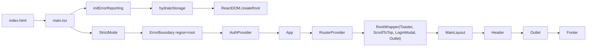
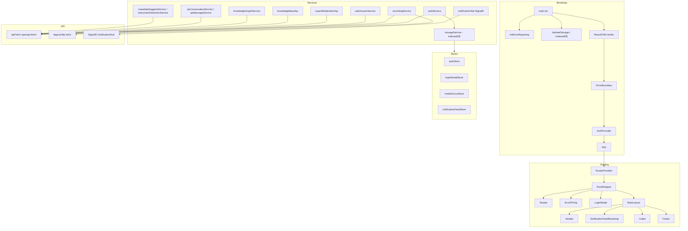

# VietTune — Frontend Context (Snapshot)

> Tài liệu mô tả chi tiết toàn bộ Frontend (FE) của VietTune dựa trên source hiện tại trong thư mục `src/`.
> Mục đích: làm "context tham chiếu" để onboard, refactor, hoặc cho AI agent đọc khi làm việc trên codebase.
> Snapshot ngày: 2026-05-08.

---

## 1. Tổng quan dự án

VietTune là hệ thống tài liệu hóa âm nhạc truyền thống Việt Nam (SEP490). Frontend phục vụ:

- **Người dùng (Guest/User)**: khám phá/tìm kiếm bản thu, xem tri thức, chat với AI.
- **Contributor**: tải lên bản thu, theo dõi đóng góp, sửa metadata.
- **Expert (Moderator)**: kiểm duyệt 3 stage, xử lý dispute/embargo, viết Knowledge Base.
- **Researcher**: cổng nghiên cứu chuyên sâu (so sánh phổ, knowledge graph, QA chat, export dataset).
- **Admin**: dashboard quản trị người dùng, analytics, AI monitoring, KB.

Repo song ngữ Anh/Việt; UI hiển thị tiếng Việt, code/identifier tiếng Anh.

---

## 2. Tech stack & versions

Trích từ `package.json`:

### Runtime libraries

| Lĩnh vực | Thư viện | Phiên bản |
|---|---|---|
| Framework | `react`, `react-dom` | `^18.2.0` |
| Routing | `react-router-dom` | `^6.21.0` |
| State | `zustand` | `^4.4.7` |
| HTTP / OpenAPI | `openapi-fetch` | `^0.14.0` |
| Realtime | `@microsoft/signalr` | `^8.0.7` |
| Auth/storage helper | `@supabase/supabase-js` | `^2.99.1` (chỉ dùng client wrapper) |
| Form | `react-hook-form` | `^7.49.3` |
| Toast | `react-hot-toast` | `^2.4.1` (đóng gói qua `@/uiToast`) |
| Date | `date-fns` | `^3.0.6` |
| Icons | `lucide-react` | `^0.309.0` |
| Audio | `wavesurfer.js` | `^7.12.5` |
| Charts | `recharts` | `^3.8.1` |
| Graph | `react-force-graph-2d`, `d3-force` | `^1.29.1`, `^3.0.0` |
| Virtualization | `@tanstack/react-virtual` | `^3.13.24` |
| Rich-text editor | `@tiptap/react` + StarterKit + extensions | `^3.22.3` |
| Spreadsheet | `xlsx` | `^0.18.5` |
| Error tracking | `@sentry/react` | `^10.38.0` |
| Style | `tailwindcss` | `^3.4.1` |
| `clsx` (className utils) | `clsx` | `^2.1.0` |

### Toolchain

- **Vite** 5 (dev port `3000`, proxy `/api → https://viettunearchiveapi-fufkgcayeydnhdeq.japanwest-01.azurewebsites.net`).
- **TypeScript** `^5.3.3`, strict mode.
- **ESLint** 8 + `@typescript-eslint`, `react`, `react-hooks`, `react-refresh`, `import`, `jsx-a11y`.
- **Prettier** 3.
- **Vitest** 2 (`vitest run`, `vitest:watch`) + `@testing-library/react` + `jsdom`.
- **Playwright** 1.49 (E2E projects: explore-guest / upload / contributions / moderation / toast / contributor / multi-role).
- **Husky** v9 (`prepare: husky`).
- **rollup-plugin-visualizer** + `@rollup/plugin-strip` (drop `console.log/info/debug` ở build production).
- **openapi-typescript** dùng để generate `src/api/generated.d.ts` từ `src/api/swagger.json`.

### NPM scripts đáng chú ý

```text
dev                 # vite dev (port 3000)
build               # tsc && vite build
build:analyze       # build + bundle visualizer report (dist/bundle-report.html)
lint / format       # ESLint / Prettier
api:pull / api:generate / api:sync   # Swagger -> openapi-typescript -> generated.d.ts
test:unit           # vitest run
test:e2e[:*]        # Playwright projects (CI/UI/prod biến thể)
check:toast         # node scripts/check-toast-conventions.mjs
```

---

## 3. Cấu hình build (Vite)

`vite.config.ts`:

- Alias `@` → `./src`.
- `manualChunks` chia vendor thành các bundle nhỏ: `vendor-react`, `vendor-sentry`, `vendor-supabase`, `vendor-signalr`, `vendor-wavesurfer`, `vendor-force-graph`, `vendor-lucide`, `vendor-virtual`, `vendor-date-fns`, `vendor-rhf`, `vendor-openapi`, `vendor-toast`, `vendor-charts`, `vendor-editor` (tiptap+prosemirror), `vendor-xlsx`, `vendor-zustand`.
- Build production strip `console.log/info/debug` + `debugger`.
- Bundle analyze qua `BUNDLE_ANALYZE=true` hoặc `--mode analyze`.
- Proxy dev: mọi `/api/*` được forward sang BE Azure.

`tsconfig.json`:

- `strict`, `noUnusedLocals`, `noUnusedParameters`, `noFallthroughCasesInSwitch`.
- `paths`: `@/*` → `./src/*`.

`.eslintrc.cjs` (đáng chú ý):

- Cấm import trực tiếp `react-hot-toast` (trừ `App.tsx` và `src/uiToast/**`).
- Cấm import từ các path đã refactor (`@/utils/exploreRecordingsLoad`, `@/hooks/useUploadWizard`, `@/hooks/useKnowledgeGraphData`, `@/pages/moderation/**`) — phải dùng `@/features/...` canonical paths.
- Naming: `interface` & `typeAlias` PascalCase, không `I`-prefix.
- `import/order`: alphabetize ascending, newline-between groups.
- `@typescript-eslint/no-floating-promises`: error (gọi async không await phải `void` rõ ràng).
- `react-refresh/only-export-components`: warn (allow `export const` constant).

---

## 4. Entry point & bootstrap



`src/main.tsx`:

```ts
async function bootstrap() {
  initErrorReporting();          // Sentry (services/errorReporting.ts)
  await hydrateStorage();        // migrate localStorage/sessionStorage -> IndexedDB
  ReactDOM.createRoot(...).render(
    <React.StrictMode>
      <ErrorBoundary region="root">
        <AuthProvider>
          <App />
        </AuthProvider>
      </ErrorBoundary>
    </React.StrictMode>,
  );
}
```

`src/App.tsx`:

- Tất cả page đều `lazy()` + `<Suspense fallback={<LoadingState />} />` ⇒ code-splitting per-route.
- Layout chia 2 nhóm:
  - **Public layout** (`MainLayout` với Header/Footer/background): mọi route không phải auth/`/403`/`*`.
  - **Auth layout**: `/login`, `/register`, `/auth/register-researcher`, `/confirm-account`, `/forgot-password` (đứng riêng, mỗi trang được bọc `ErrorBoundary region="auth"`).
- Các route được bảo vệ bởi `<AdminGuard />` và `<ResearcherGuard />`.
- `RootWrapper` render duy nhất 1 `<Toaster>`, `<ScrollToTop>`, `<LoginModal>` (modal toàn cục) + `<Outlet />`.

---

## 5. Routing — danh sách đầy đủ

Public/main routes (qua `MainLayout`):

| Path | Component | Ghi chú |
|---|---|---|
| `/` | `HomePage` | Researcher/Expert sẽ bị redirect sang portal/moderation nếu `isActive`. |
| `/explore` | `ExplorePage` | Catalog + filter + search (URL query). |
| `/recordings/:id` | `RecordingDetailPage` | |
| `/recordings/:id/edit` | `EditRecordingPage` | Candidate auth route. |
| `/upload` | `UploadPage` | Wizard tải lên (Contributor). |
| `/search` | `SearchPage` | Title search. |
| `/semantic-search` | `SemanticSearchPage` | 768-dim vector search. |
| `/chatbot` | `ChatbotPage` | VietTune Intelligence (AI). |
| `/knowledge-base` | `KnowledgeExplorePage` | Public KB explorer. |
| `/kb/entry/:id` | `KbEntryPublicViewPage` | KB entry public view. |
| `/instruments` | `InstrumentsPage` | |
| `/ethnicities` | `EthnicitiesPage` | |
| `/masters` | `MastersPage` | Nghệ nhân. |
| `/about` | `AboutPage` | |
| `/terms` | `TermsPage` | |
| `/profile` | `ProfilePage` | Auth-only (TODO route policy). |
| `/contributions` | `ContributionsPage` | Contributor-only. |
| `/dashboard` | `<Navigate to="/moderation" replace />` | Legacy alias. |
| `/moderation` | `ModerationPage` | Expert/Admin. |
| `/approved-recordings` | `ApprovedRecordingsPage` | Expert/Admin. |
| `/notifications` | `NotificationPage` | Auth-only. |
| `/researcher` | `ResearcherPortalPage` | Bọc `ResearcherGuard`. |
| `/admin` | `AdminDashboard` | Bọc `AdminGuard`. |
| `/admin/create-expert` | `CreateExpertPage` | Bọc `AdminGuard`. |
| `/admin/knowledge-base` | `KnowledgeBasePage` | Bọc `AdminGuard`. |

Auth/standalone routes (không có layout chính):

| Path | Component |
|---|---|
| `/login` | `LoginPage` |
| `/register` | `RegisterPage` |
| `/auth/register-researcher` | `RegisterPage` (variant qua URL) |
| `/confirm-account` | `ConfirmAccountPage` |
| `/forgot-password` | `ForgotPasswordPage` |
| `/403` | `ForbiddenPage` |
| `*` | `NotFoundPage` |

### Route guards

`src/utils/routeAccess.ts`:

- `RouteGuardPolicy { allowedRoles, unauthorizedRedirectTo, inactiveRedirectTo, requireActive }`.
- `ADMIN_ROUTE_POLICY`: `[ADMIN]`, redirect 403, requireActive.
- `RESEARCHER_ROUTE_POLICY`: `[RESEARCHER, ADMIN, EXPERT]`, redirect 403, requireActive.
- `evaluateGuardAccess(user, pathname, policy, { isAuthLoading })` → `'allow' | 'defer' | 'redirect'`.
- `parseSafeRedirectParam(value)` chống open-redirect (chỉ chấp nhận `/...` không bắt đầu `//`).
- `getDefaultPostLoginPath(user)`:
  - `ADMIN → /admin`, `RESEARCHER → /researcher`, `EXPERT → /moderation`, mặc định `/`.
- `resolvePostLoginPath(user, requestedRedirect)` kiểm tra path có hợp lệ với role không (ví dụ `/admin` chỉ cho ADMIN).

`AdminGuard.tsx` & `ResearcherGuard.tsx` dùng cùng pattern: gọi `evaluateGuardAccess`, render Card chuyển hướng nếu `redirect`, render skeleton nếu `defer`, hoặc `<Outlet />` qua `ErrorBoundary` nếu `allow`.

`MainLayout.tsx` còn có 2 effect đặc biệt:

- Researcher active → redirect `/` sang `/researcher` (Researcher coi `/researcher` là trang chủ).
- Expert active → redirect `/` sang `/moderation`.
- Lưu `lastVisitedPage` vào storage (loại trừ `/login`, `/register`).

---

## 6. Cấu trúc thư mục `src/`

```text
src/
├── App.tsx                # Router + Suspense + RootWrapper
├── main.tsx               # bootstrap
├── index.css              # Tailwind layers + CSS variables + components
├── vite-env.d.ts
│
├── api/                   # OpenAPI client + legacy fetch
│   ├── client.ts          # apiFetch (openapi-fetch) + apiOk + apiFetchLoose
│   ├── adapters.ts        # Type aliases tới schemas + path/query types
│   ├── generated.d.ts     # 381KB — sinh từ swagger.json
│   ├── swagger.json       # OpenAPI spec hiện tại
│   ├── swagger.latest.json
│   ├── legacyHttp.ts      # legacyGet/Post/Put + legacyGetAnonymous (fetch raw)
│   ├── httpClientRequestConfig.ts
│   └── index.ts           # re-exports
│
├── components/
│   ├── admin/             # AdminGuard, ResearcherGuard, AdminDashboard*
│   ├── auth/              # LoginFormContent, LoginModal, AuthHeader
│   ├── common/            # Button/Card/Input/Badge/Dialog/Pagination/...
│   ├── features/          # AudioPlayer, VideoPlayer, SearchBar, FilterSidebar...
│   │   ├── ai/            # FlaggedResponseList
│   │   ├── analytics/     # ContentAnalyticsPanel, ContributorLeaderboard, charts
│   │   ├── annotation/    # AnnotationForm/List/Panel
│   │   ├── chatbot/       # ChatMessageItem, ChatSidebar
│   │   ├── contributions/ # ContributionCard/Filters/ListSection/DetailModal
│   │   ├── kb/            # KBEntryForm/List, KBRichTextEditor, KBCitationManager
│   │   ├── moderation/    # 30+ components, có `workspaceTabs/` con
│   │   ├── research/      # ExportDatasetDialog
│   │   ├── search/        # SearchBarPrimitives
│   │   ├── submission/    # SubmissionVersionTimeline
│   │   └── upload/        # MultiSelectTags, MetadataSuggestionPanel, steps/...
│   ├── image/             # logo, background, branding (PNG + module re-export)
│   ├── layout/            # MainLayout, Header (~26KB), Footer
│   └── researcher/        # DualAudioComparePlayer, ResearcherPortal*Tab, QAChatHistorySidebar
│
├── config/                # Hằng số app
│   ├── constants.ts
│   ├── expertWorkflowPhase.ts
│   ├── moderationAiSummaryUi.ts
│   ├── moderationSimilarRecordingsUi.ts
│   ├── moderationStageUi.ts
│   ├── notificationPollConstants.ts
│   ├── provinceRegionCodes.ts
│   └── validationConstants.ts
│
├── constants/
│   └── exploreFilterOptions.ts
│
├── contexts/
│   └── AuthContext.tsx    # Provider + useAuth (fallback authStore)
│
├── features/              # Domain-specific modules
│   ├── admin/             # adminDashboardTypes + hooks/useAdminDashboardData
│   ├── annotation/        # hooks: useAnnotationForm, useAnnotations
│   ├── compare-engine/    # AudioEngine, FFTProcessor, SpectrogramRenderer, workers, hooks
│   ├── contributions/     # contributionDisplayUtils, hooks
│   ├── explore/           # exploreFacetDraft, exploreRecordingsLoad, useExploreFilterOptions
│   ├── knowledge-graph/   # KnowledgeGraphViewer, useKnowledgeGraphController/Data
│   ├── moderation/        # constants/aiAnalysisState/moderationStage, hooks (Wizard, Queue), utils, types
│   ├── researcher/        # researcherPortalTypes, useResearcherData
│   ├── search/            # searchBarConstants
│   └── upload/            # 10 hooks (useUploadForm/Submission/Wizard/...), constants
│
├── hooks/                 # Cross-domain hooks
│   ├── useApprovedRecordings.ts
│   ├── useButtonAnchorRect.ts
│   ├── useChatbotSession.ts
│   ├── useDebounce.ts
│   ├── useExploreData.ts
│   ├── useMediaQuery.ts
│   ├── useNotificationFeedEngine.ts
│   ├── useNotificationPolling.ts
│   ├── usePollWhileVisible.ts
│   ├── useRecordingDetail.ts
│   ├── useVideoDataUrlSource.ts
│   └── useVideoPlayback.ts
│
├── pages/                 # Route pages (đã liệt kê ở mục 5)
│
├── services/              # API/business logic (≈40 file)
│   ├── adminApi.ts                # admin user mgmt
│   ├── analyticsApi.ts            # analytics endpoints
│   ├── annotationApi.ts           # annotations
│   ├── authService.ts             # login/register/forgot/confirm/demo
│   ├── accountDeletionService.ts
│   ├── copyrightDisputeApi.ts
│   ├── embargoApi.ts
│   ├── ethnicityService.ts
│   ├── expertModerationApi.ts     # expert workflow APIs
│   ├── expertWorkflowService.ts
│   ├── geocodeService.ts
│   ├── instrumentDetectionService.ts
│   ├── instrumentService.ts
│   ├── knowledgeBaseApi.ts
│   ├── knowledgeGraphService.ts
│   ├── metadataSuggestService.ts
│   ├── notificationHub.ts         # SignalR client
│   ├── qaConversationService.ts
│   ├── qaMessageService.ts
│   ├── recordingRequestService.ts # delete/edit notification mapper
│   ├── recordingService.ts        # main recording CRUD/search
│   ├── recordingStorage.ts        # local recordings (IndexedDB-backed)
│   ├── referenceDataService.ts
│   ├── researcherArchiveService.ts
│   ├── researcherChatService.ts
│   ├── researcherRecordingFilterSearch.ts
│   ├── semanticSearchService.ts
│   ├── serviceApiClient.ts        # type cho legacy client
│   ├── serviceLogger.ts
│   ├── spectrogramManifestService.ts
│   ├── storageService.ts          # IndexedDB-backed kv (xem mục 9)
│   ├── submissionApiMapper.ts
│   ├── submissionService.ts
│   ├── submissionVersionApi.ts
│   ├── supabaseClient.ts
│   ├── uploadService.ts
│   ├── errorReporting.ts          # Sentry init
│   └── *.test.ts
│
├── stores/                # Zustand stores
│   ├── authStore.ts               # user, isAuthenticated, login/logout/setUser/fetchCurrentUser
│   ├── loginModalStore.ts         # global LoginModal trigger
│   ├── mediaFocusStore.ts         # 1 active media id (audio/video pause others)
│   └── notificationFeedStore.ts   # notifications + signalR + isInitialLoading
│
├── types/                 # Domain types (xem mục 8)
│   ├── analytics.ts
│   ├── annotation.ts
│   ├── api.ts                     # SearchFilters, ApiResponse, PaginatedResponse
│   ├── chat.ts
│   ├── copyrightDispute.ts
│   ├── embargo.ts
│   ├── graph.ts
│   ├── index.ts                   # re-export hub
│   ├── instrumentDetection.ts
│   ├── knowledgeBase.ts
│   ├── knowledgeGraphApi.ts
│   ├── moderation.ts              # ApiSubmissionStatus + ModerationStatus mapper
│   ├── mutationResult.ts
│   ├── notification.ts
│   ├── recording.ts               # Recording + LocalRecording + enums
│   ├── reference.ts               # Ethnicity/Region/Instrument/Performer
│   ├── spectrogramManifest.ts
│   ├── submissionVersion.ts
│   └── user.ts                    # User + UserRole + form types
│
├── uiToast/               # Toast wrapper (lib-agnostic)
│   ├── index.ts
│   ├── interpolate.ts             # {{var}} replace
│   ├── messageCatalog.ts          # MESSAGE_CATALOG (vi-VN keys)
│   ├── normalizeApiError.ts       # parse axios/fetch error → NormalizedApiError
│   ├── toastApiError.ts
│   ├── types.ts
│   ├── uiToast.ts                 # success/error/info/warning/promise/fromApiError
│   └── __tests__/
│
└── utils/                 # Pure helpers
    ├── annotationHelpers.ts
    ├── apiHelpers.ts
    ├── contributorFields.ts
    ├── crossCaseInstrumentWarning.ts
    ├── datasetExport.ts
    ├── exploreFacetDraft.ts          # thin re-export → features/explore
    ├── exploreGuestFilters.ts        # thin re-export
    ├── exploreSemanticRank.ts        # thin re-export
    ├── gpsRegionHint.ts
    ├── helpers.ts                    # cn(), formatRelativeTimeVi(), migrateVideoData...
    ├── httpError.ts
    ├── instrumentDeclaredDetectedCompare.ts
    ├── instrumentMetadataMapper.ts
    ├── jwtExpiry.ts                  # decode JWT exp
    ├── kbCitations.ts
    ├── layoutFeatureItems.ts         # Header nav items
    ├── localRecordingToRecording.ts
    ├── mapInstrumentDetectionRow.ts
    ├── notificationRoutes.ts         # AppNotification → target path
    ├── notificationTypeMap.ts
    ├── recordingTags.ts              # getRegionDisplayName, ...
    ├── routeAccess.ts                # Guards + redirect helpers
    ├── searchText.ts                 # normalizeSearchText (VI accent strip)
    ├── surfaceTokens.ts              # SURFACE_PANEL_GRADIENT
    ├── validation.ts
    └── youtube.ts
```

---

## 7. State management

FE dùng **Zustand** + 1 React Context mỏng (`AuthContext`) để truyền state.

### 7.1. `useAuthStore` — `src/stores/authStore.ts`

```ts
interface AuthState {
  user: User | null;
  isAuthenticated: boolean;
  isLoading: boolean;
  error: string | null;
  login: (email, password) => Promise<void>;
  logout: () => void;
  setUser: (user: User | null) => void;
  fetchCurrentUser: () => Promise<void>;
  clearError: () => void;
}
```

- Khởi tạo `user`/`isAuthenticated` đồng bộ từ `authService.getStoredUser()` + `isAuthenticated()` (kiểm tra JWT exp).
- `setUser` còn persist sang IndexedDB qua `storageService.setItem` đồng thời cập nhật `users_overrides` (giữ override demo/profile khi reload), và cố gắng `processPendingProfileUpdates()`.
- `fetchCurrentUser` *không* tự logout khi 401/network — giữ user đã lưu để tránh "rớt" khi BE chập chờn.

### 7.2. `AuthContext` — `src/contexts/AuthContext.tsx`

- Provider đọc state từ `useAuthStore` qua `useShallow`.
- `useEffect` mount: `clearExpiredCredentialsIfNeeded()` → `getStoredUser()` → `setUser(...)`. Chỉ render children sau khi `isInitialized = true` (chống flicker).
- `useAuth()` ưu tiên context, fallback `authStore` (cảnh báo dev nếu thiếu provider).

### 7.3. `useLoginModalStore`

- `isOpen`, `redirectTo`, `onSuccessCallback`.
- `openLoginModal({ redirect, onSuccess })` validate qua `parseSafeRedirectParam`.
- DEV mode expose ra `window.__loginModalStore` để debug Phase-1.

### 7.4. `useMediaFocusStore`

- Chỉ có `activeMediaId`. Khi 1 player phát, nó set id; player khác (audio/video) subscribe và tự pause → đảm bảo "single active media" toàn page.

### 7.5. `useNotificationFeedStore`

- `notifications`, `fetchError`, `isInitialLoading`, `signalRConnected`, `activeRole`.
- Action: `setNotifications`, `prependNotification` (dedupe theo id), `removeNotification`, `setSignalRConnected`, `setActiveRole`, `reloadNotifications` (initial = noop, được "wire" bởi `NotificationFeedBootstrap`/`useNotificationFeedEngine`).

---

## 8. Domain types

`src/types/index.ts` re-export tất cả. Đây là "ngôn ngữ chung" của FE.

### 8.1. User & roles

```ts
enum UserRole {
  ADMIN = 'Admin',
  MODERATOR = 'Moderator',     // legacy
  RESEARCHER = 'Researcher',
  CONTRIBUTOR = 'Contributor',
  EXPERT = 'Expert',
  USER = 'User',
}

interface User {
  id: string; username: string; email: string; fullName: string;
  role: UserRole; avatar?: string; bio?: string; expertise?: string[];
  phoneNumber?: string; isActive?: boolean; isEmailConfirmed?: boolean;
  createdAt: string; updatedAt: string;
}

interface LoginForm { email: string; password: string; }
interface RegisterForm { username; email; password; confirmPassword; fullName; phoneNumber; }
interface RegisterResearcherForm { email; password; fullName; phoneNumber; }
interface ConfirmAccountForm { otp: string; }
```

### 8.2. Recording (`types/recording.ts`)

- `Recording` (canonical FE shape) gồm `ethnicity`, `region`, `recordingType`, `audioUrl`, `instruments[]`, `performers[]`, `metadata: RecordingMetadata`, `verificationStatus`, `viewCount/likeCount/downloadCount`, `_semanticScore?`.
- `RecordingType` enum: `INSTRUMENTAL | VOCAL | CEREMONIAL | FOLK_SONG | EPIC | LULLABY | WORK_SONG | OTHER`.
- `RecordingQuality` enum: `PROFESSIONAL | FIELD_RECORDING | ARCHIVE | DIGITIZED`.
- `VerificationStatus` enum: `PENDING | VERIFIED | REJECTED | UNDER_REVIEW`.
- `LocalRecording` — shape rộng hơn, chứa `audioData`, `videoData`, `youtubeUrl`, `mediaType`, `gpsLatitude/Longitude`, `basicInfo`, `culturalContext`, `moderation { status, claimedBy, reviewerId, rejectionNote, contributorEditLocked }`, `resubmittedForModeration`. Dùng cho dữ liệu local/IndexedDB và submissions chưa duyệt.

### 8.3. Reference (`types/reference.ts`)

- `Ethnicity`, `Region` enum (`NORTHERN_MOUNTAINS | RED_RIVER_DELTA | NORTH_CENTRAL | SOUTH_CENTRAL_COAST | CENTRAL_HIGHLANDS | SOUTHEAST | MEKONG_DELTA`).
- `Instrument`, `InstrumentCategory` (`STRING | WIND | PERCUSSION | IDIOPHONE | VOICE`).
- `Performer`.

### 8.4. Moderation (`types/moderation.ts`)

- `ApiSubmissionStatus` = số 0..5 (lấy từ `components['schemas']` BE).
- `ModerationStatus` (FE-only): `PENDING_REVIEW | IN_REVIEW | APPROVED | REJECTED | TEMPORARILY_REJECTED | EMBARGOED`.
- `toApiSubmissionStatus(raw)`, `toModerationUiStatus(raw)` chuyển đổi qua lại (BE đôi khi trả enum số/chuỗi).

### 8.5. Notification (`types/notification.ts`)

- `AppNotification.type` union ~18 giá trị: `recording_deleted/edited`, `submission_pending_review/approved/rejected/updated/claimed/unassigned`, `delete_request_forwarded/rejected`, `edit_request_approved`, `edit_submission_approved`, `expert_account_deletion_approved/expert_deletion_requested`, `dispute_resolved`, `embargo_lifted`, `role_changed`, `account_activated/deactivated`.
- Interfaces phụ: `ExpertAccountDeletionRequest`, `DeleteRecordingRequest`, `EditRecordingRequest`, `EditSubmissionForReview`.

### 8.6. API contract (`types/api.ts`)

```ts
interface SearchFilters {
  query?; ethnicityIds?; regions?; recordingTypes?; instrumentIds?;
  performerIds?; verificationStatus?; dateFrom?; dateTo?; tags?;
}
interface ApiResponse<T> { data: T; message?; success: boolean; }
interface PaginatedResponse<T> { items: T[]; total; page; pageSize; totalPages; }
```

Các type khác: `analytics`, `annotation`, `chat`, `copyrightDispute`, `embargo`, `graph`, `instrumentDetection`, `knowledgeBase`, `knowledgeGraphApi`, `mutationResult`, `spectrogramManifest`, `submissionVersion`.

---

## 9. Storage layer (IndexedDB-backed)

`src/services/storageService.ts` thay cho `localStorage/sessionStorage` (chống quota + chứa file lớn).

- DB: `VietTuneDB`, store `kv`.
- API:
  - `hydrate()` (gọi 1 lần lúc bootstrap): migrate localStorage/sessionStorage → IndexedDB → preload cache (cap `MAX_CACHE_KEYS=200`, bỏ qua value > `MAX_CACHE_VALUE_SIZE=200KB`) → `ensureAuthKeysInCache(['user', 'access_token'])`.
  - `getItem(key)` đồng bộ (cache only).
  - `getItemAsync(key)` cache hoặc IDB (dùng cho key lớn như `localRecordings`).
  - `setItem(key, value)` async; values ≤200KB cũng được cache.
  - `removeItem(key)` async.
  - `sessionGetItem/sessionSetItem/sessionRemoveItem` (prefix `session_`).
- Lý do: tránh OOM khi `localRecordings` chứa base64 audio/video lớn; vẫn giữ sync API cho code legacy.

`src/services/recordingStorage.ts` xây trên storageService — quản lý meta list & full record cho upload/local mode.

---

## 10. API layer

### 10.1. OpenAPI client — `src/api/client.ts`

```ts
export const apiFetch = createClient<paths>({
  baseUrl: resolveOpenApiBaseUrl(API_BASE_URL),     // strip "/api" suffix
  headers: { 'Content-Type': 'application/json' },
});

apiFetch.use({ async onRequest({ request }) {
  const token = getItem('access_token');
  if (token) request.headers.set('Authorization', `Bearer ${token}`);
  return request;
}});
```

- `apiOk(envelope)`: throw lỗi `Error` có gắn `.response = {status, data, headers, url}` (mô phỏng axios) khi BE trả error.
- `asApiEnvelope<T>(promise)`, `openApiQueryRecord<T>(query)`.
- `apiFetchLoose`: cast loose để gọi path không nằm strictly trong typed paths (ví dụ `/api/Auth/login` được dùng dưới dạng raw string).

### 10.2. Legacy fetch — `src/api/legacyHttp.ts`

- `legacyGet/legacyPost/legacyPut`: dùng `fetch` thuần, attach Bearer, parse text/JSON, throw chuẩn.
- `legacyGetAnonymous`: GET không gửi token (catalog guest, public).
- `legacyPostJsonAsText`: POST JSON nhận `text/plain` (chat AI).

### 10.3. Generated types — `src/api/generated.d.ts`

- Sinh từ `swagger.json` qua `openapi-typescript`.
- 381KB; cấm sửa tay.
- `paths` (OpenAPI path → method → query/body/response) và `components['schemas']`.

### 10.4. Adapters — `src/api/adapters.ts`

- Tập trung re-name các schema/path types thành alias `Api*`:
  - DTO: `ApiAnnotationDto`, `ApiRecordingDto`, `ApiSubmissionDto`, `ApiSubmissionVersionDto`, `ApiEmbargoDto`, `ApiEthnicGroupDto`, `ApiInstrumentDto`, KB, Dispute requests…
  - Query types per endpoint: `ApiRecordingListQuery`, `ApiRecordingSearchByFilterQuery`, `ApiAdminUsersListQuery`, `ApiAnalyticsExpertsQuery/ContentQuery`, `ApiAuthConfirmEmailQuery`, `ApiSemanticSearchQuery/768Query`, `ApiQAMessageListQuery/byConversation/Flag`.
  - Auth models: `ApiAuthLoginModel`, `ApiAuthRegisterModel`, `ApiAuthForgotPasswordModel`, `ApiAuthResetPasswordModel`.

### 10.5. Patterns sử dụng

```ts
// Strict OpenAPI
const data = await apiOk(asApiEnvelope<PaginatedResponse<Recording>>(
  apiFetch.GET('/api/Recording', {
    params: { query: openApiQueryRecord({ page, pageSize }) },
    signal,
  })
));

// Loose (path không có hoặc body khác)
await apiOk(asApiEnvelope<LoginResponse>(
  apiFetchLoose.POST('/api/Auth/login', { body: payload })
));

// Public (không Bearer)
await legacyGetAnonymous<unknown>('/RecordingGuest', { params: { page, pageSize } });
```

---

## 11. Services layer (business APIs)

Bảng tóm tắt các service chính trong `src/services/`:

| Service | Mục đích | Endpoint chính |
|---|---|---|
| `authService.ts` | Login/register/forgot/confirm/demo. Lưu JWT vào storage. | `/api/Auth/login`, `/api/Auth/register-contributor`, `/api/Auth/register-researcher`, `/api/Auth/confirm-email`, `/api/Auth/forgot-password` |
| `recordingService.ts` | Search/CRUD bản thu (guest + auth + filter + by-title). Map BE shape lệch về `Recording`. | `/api/Recording*`, `/api/RecordingGuest*`, `/api/Submission/create-submission`, `/api/RecordingImage` |
| `submissionService.ts` | Quản lý submission (Contributor lifecycle). | `/api/Submission/*` |
| `submissionVersionApi.ts` | Lịch sử version của submission. | |
| `submissionApiMapper.ts` | DTO ↔ FE mapper. |
| `expertModerationApi.ts` | Expert lấy queue, claim, approve, reject, AI summary. | `/api/Submission/get-by-status`, `/api/Submission/confirm-submit-submission`, ... |
| `expertWorkflowService.ts` | Logic 3-stage cho Expert. |
| `recordingRequestService.ts` | Notifications + delete/edit request mapping. Dùng bởi `notificationHub` và Header. |
| `notificationHub.ts` | SignalR client (`/notificationHub`). |
| `qaConversationService.ts`, `qaMessageService.ts`, `researcherChatService.ts` | Researcher QA chat, kèm flagged response. |
| `semanticSearchService.ts` | `GET /api/search/semantic-768`. |
| `metadataSuggestService.ts` | AI-suggest metadata khi upload. |
| `instrumentDetectionService.ts` | Phân tích nhạc cụ AI (declared vs detected). |
| `knowledgeBaseApi.ts`, `knowledgeGraphService.ts` | KB & Graph data. |
| `embargoApi.ts`, `copyrightDisputeApi.ts` | Moderation phụ trợ. |
| `analyticsApi.ts` | Admin/expert analytics. |
| `adminApi.ts`, `accountDeletionService.ts` | Admin user mgmt. |
| `referenceDataService.ts`, `instrumentService.ts`, `ethnicityService.ts`, `geocodeService.ts` | Master data. |
| `researcherArchiveService.ts`, `researcherRecordingFilterSearch.ts` | Researcher portal. |
| `uploadService.ts` | Upload file (multipart/storage). |
| `storageService.ts`, `recordingStorage.ts` | (xem mục 9). |
| `errorReporting.ts` | Sentry init + capture wrapper. |
| `serviceLogger.ts` | `logServiceError/Warn` (no-op khi sản phẩm strip console). |
| `serviceApiClient.ts` | Type cho legacy http client. |
| `supabaseClient.ts` | (giữ chỗ — Supabase chưa dùng nhiều). |

---

## 12. Hooks (top-level + per-feature)

### 12.1. `src/hooks/`

| Hook | Vai trò |
|---|---|
| `useApprovedRecordings` | Lấy list bản thu đã duyệt cho Expert/Admin. |
| `useButtonAnchorRect` | Đo vị trí button cho dropdown portal. |
| `useChatbotSession` | Tạo/giữ session cho chatbot. |
| `useDebounce` | Generic debounce. |
| `useExploreData` | Tải catalog Explore (paginated + filters). |
| `useMediaQuery` | matchMedia React hook. |
| `useNotificationFeedEngine` | Wire SignalR + polling vào `notificationFeedStore`. |
| `useNotificationPolling` | Selector từ store, trả `notifications/unreadCount/reload/...`. |
| `usePollWhileVisible` | Polling chỉ khi tab visible. |
| `useRecordingDetail` | Fetch + cache 1 recording theo id. |
| `useVideoDataUrlSource` | Convert base64/blob → URL cho video. |
| `useVideoPlayback` | Video player state machine. |

### 12.2. `src/features/*/hooks/`

- **upload/hooks/** (10 hooks): `useUploadForm`, `useUploadSubmission` (~28KB), `useUploadWizard`, `useMediaUpload`, `useUploadAiAdvisory`, `useUploadDialogChrome`, `useUploadEditReferenceEffects`, `useUploadRecordingLoader`, `useUploadReferenceData`, + tests.
- **moderation/hooks/**: `useModerationWizard` (3-stage state machine), `useModerationDetailViewModel`, `useExpertQueue`, `useAIAnalysisSummary`, `useRecordingMetadataSuggestions`, `useSimilarRecordings`, `useSubmissionOverlay`.
- **explore/hooks/**: `useExploreFilterOptions`.
- **knowledge-graph/hooks/**: `useKnowledgeGraphController`, `useKnowledgeGraphData`, `useKnowledgeGraphExplore`, `useKnowledgeGraphOverview`, `useKnowledgeGraphSearch`, `useKnowledgeGraphStats` (+ `internal/`).
- **compare-engine/hooks/**: `useCompareEngine` (~17KB — wavesurfer + spectrogram orchestration), `useKeyboardShortcuts`, `useSpectrogramMode`.
- **researcher/hooks/**: `useResearcherData`.
- **contributions/hooks/**: `useContributionsData`, `useContributionsStatusTabA11y`.
- **admin/hooks/**: `useAdminDashboardData` (~22KB).
- **annotation/hooks/**: `useAnnotationForm`, `useAnnotations`.

---

## 13. Real-time (SignalR)

`src/services/notificationHub.ts`:

- URL: `VITE_SIGNALR_HUB_URL` hoặc `${API_BASE_URL stripped}/notificationHub`.
- `HubConnectionBuilder.withAutomaticReconnect([0, 2000, 5000, 10000, 30000])`.
- `accessTokenFactory` lấy từ `storageService.getItem('access_token')`.
- Sự kiện `ReceiveNotification` → `mapNotificationFromApiRecord` → emit cho listeners.
- `subscribeNotificationHub(listener)` trả unsubscribe; auto stop khi không còn listener.
- `hubPermanentlyUnavailable` flag: nếu hub trả 404/403 → ngừng retry.
- `connectionStateHandler` được set bởi `useNotificationFeedEngine` để phát `signalRConnected` vào store.

`NotificationFeedBootstrap` (`components/common/NotificationFeedBootstrap.tsx`) gắn engine vào tree để mọi page đều nhận noti realtime.

---

## 14. Toast / messaging — `src/uiToast/`

Mục tiêu: **đóng kín** `react-hot-toast` để khi đổi lib chỉ sửa 1 nơi.

- `messageCatalog.ts` chứa key tiếng Việt cho:
  - `common.network/timeout/unknown`, `common.http_400/401/403/404/422/500`.
  - `moderation.delete.{success,failed}`, `moderation.approve.{local,server}_failed/success`, `moderation.reject.{...}`, `moderation.wizard.step_incomplete/ready_for_approve`.
  - `auth.profile.sync_success`, `auth.login.success`.
  - `upload.ai.{partial_fail,success_detail}`, `upload.save.{success_edit,success_draft}`.
- `interpolate('{{step}}', { step: 2 })` thay biến.
- `uiToast.success/error/info/warning/promise/fromApiError(err, fallbackKey)`.
- `fromApiError` dùng `getNormalizedApiError` (parse từ `response.data` hoặc field `attachNormalizedApiError`) → map status/code → catalog key.
- ESLint rule cấm dùng trực tiếp `react-hot-toast` ngoài `App.tsx` và `src/uiToast/**`.
- Kiểm tra convention: `npm run check:toast` (`scripts/check-toast-conventions.mjs`).

---

## 15. UI / Theming

### 15.1. Tailwind tokens — `tailwind.config.js`

- **primary** (Đỏ VietTune): 50→900, mid `500=#da251d`, `700=#a11912`.
- **secondary** (Vàng cờ VN): 50→900, mid `500=#f59e0b`.
- **neutral**: 50→900 (cream + gray hỗn hợp).
- **cream**: `50=#FFF7E6`, `100=#FFF2D6`, `200=#FFECC4`.
- **surface.panel** = `#FFFCF5` (panel cream).
- Animation custom: `noti-fade-in` (translateY 4px → 0, fade in 0.35s).

### 15.2. `src/index.css`

- Tailwind layers + global resets.
- Body bg `#fff2d6` (cream — VietTune signature).
- Cursor: tắt I-beam mặc định, bật pointer cho button/link/role; input/textarea giữ I-beam.
- Webkit/Firefox scrollbar: thumb đỏ `#7f1d1d`.
- Override `bg-white` → cream (utility class trên thực tế render màu kem).
- Component layer:
  - `btn`, `btn-primary/secondary/outline`, `input`, `card`, `badge*`.
  - `vt-container`, `vt-container-bordered`, `vt-section-accent`.
  - `vt-header-container`, `vt-footer-container` (đỏ).
  - `btn-vt-primary/secondary/outline/ghost/icon` (rounded-full, shadow + hover scale 0.98).
  - Legacy aliases: `.spotlight-container`, `.btn-liquid-glass-*`.
- Keyframes: `fadeIn`, `slideUp` (login OTP card), `waterRipple` (waveform reflection).

### 15.3. Layout

- `MainLayout` wrap toàn bộ trong `<div className="bg-[#FFF2D6]">`, `<main>` có background image (`backgroundImage` `` import) — `backgroundAttachment: fixed` với fallback `scroll` trên iOS hoặc `prefers-reduced-motion`.
- `Header` cố định (`fixed top-0`, `z-[60]`), `<main>` padding-top `pt-32 lg:pt-40` để chừa header.
- Header chứa logo + nav (Search/Chatbot/Knowledge-base/...), notification bell (chỉ Contributor/Expert/Admin active), account dropdown, mobile menu (overflow-x scroll).

### 15.4. Common components (`src/components/common/`)

`BackButton`, `Badge`, `Button`, `Card`, `ConfirmationDialog`, `ErrorBoundary` (props `region: 'root' | 'auth' | 'main' | 'admin' | ...`), `ErrorFallback`, `Input`, `InstrumentConfidenceBar`, `LoadingSpinner`, `LoadingState`, `NotificationFeedBootstrap`, `NotificationTypeIcon`, `Pagination`, `ScrollToTop`, `SearchableDropdown` (~15KB — portal-based, keyboard nav), `UploadProgressDialog`.

---

## 16. Compare engine (Researcher)

`src/features/compare-engine/`:

- **AudioEngine.ts** — load 2 source audio + sync seek/play/pause.
- **FFTProcessor.ts** — FFT cho buffer.
- **SpectrogramComputer.ts** + `workers/` — chạy FFT trong Web Worker (fallback main thread).
- **SpectrogramRenderer.ts** — render spectrogram lên canvas, color maps (`colorMaps.ts`).
- **DifferenceAnalysis.ts** — `buildDifferenceMatrix`, `summarizeDifference` (divergence, bass/mid/treble, similarity).
- **SyncController.ts**, **CompareController.ts**, **OverlayManager.ts**, **AnalysisLayer.ts**.
- **constants.ts**: `DEFAULT_FFT_SIZE`, `DEFAULT_HOP_SIZE`.
- **compareRendererMode.ts**: feature-flag `USE_CUSTOM_SPECTROGRAM_RENDERER`.
- Components (`features/compare-engine/components/`): `CompareWorkstation`, `CompareToolbar`, `CompareTimeline`, `DifferenceScoreCard`, `EthnoResearchPanel`, `MetadataDrawer`, `SpectrogramCanvas`, `SpectrogramDebugPanel`, `WaveSurferSpectrogramCompare`.
- Hook `useCompareEngine` (~17KB) orchestrate WaveSurfer (with `Spectrogram` plugin) cho 2 nguồn.

---

## 17. Knowledge graph

`src/features/knowledge-graph/`:

- `KnowledgeGraphViewer.tsx` (~19KB) — `react-force-graph-2d` + `d3-force`, vẽ đồ thị nhạc cụ/dân tộc/khu vực.
- `useKnowledgeGraphController` (~16KB) — selection, zoom, breadcrumb, filter.
- `useKnowledgeGraphData` — loader (call `knowledgeGraphService`).
- `GraphBreadcrumb`, `GraphInsights`, `GraphToolbar`.

---

## 18. Moderation (Expert workflow 3-stage)

`src/features/moderation/`:

- `constants/moderationStage.ts` — khai báo 3 stage; `verificationStepDefinitions.ts` — checklist các bước bắt buộc.
- `constants/aiAnalysisState.ts` — trạng thái AI summary.
- `hooks/useModerationWizard.ts` (~10KB) — state machine wizard (next/prev/submit/canApprove).
- `hooks/useExpertQueue.ts` — queue Expert (claim/release).
- `hooks/useAIAnalysisSummary.ts`, `useRecordingMetadataSuggestions.ts`, `useSimilarRecordings.ts`, `useSubmissionOverlay.ts`.
- `utils/`: `moderationApproveReject.ts` (logic optimistic + rollback toast), `moderationDetailRecording.ts`, `expertQueueProjection.ts`, `expertSubmissionLock.ts`, `queueStatusMeta.ts`, `countStepCompletion.ts`, `buildRecordingForModerationWizard.ts`, `resolveReferenceDisplayStrings.ts`, `moderationDisplayMerge.ts`, `moderationChecklistConfig.ts`.
- `types/localRecordingQueue.types.ts`.

UI: `src/components/features/moderation/` (~35 file) + `workspaceTabs/` (AI / Embargo / Metadata / SimilarRecordings / Timeline). Page: `src/pages/ModerationPage.tsx` (~33KB).

---

## 19. Upload wizard (Contributor)

`src/features/upload/`:

- `uploadConstants.ts`, `uploadFormValidation.ts`, `uploadRecordingTypes.ts`.
- 10 hooks (xem mục 12.2). `useUploadSubmission` (~28KB) là core: upload media → tạo submission → poll trạng thái → mapping LocalRecording → IndexedDB.
- `MetadataStepSection.tsx` (~34KB) — form metadata bước 2.
- `MediaUploadStep.tsx` (~29KB) — bước 1 (file/Youtube), validate kích thước (`MAX_FILE_SIZE = 100MB`), formats audio (`mpeg/wav/flac/ogg`).
- `UploadConfirmDialogs`, `UploadDatePicker`, `UploadFormFields`, `UploadFormPrimitives`, `UploadMediaPreview`, `UploadSearchableDropdown`, `UploadWizardActions`, `UploadWizardStepper`, `MultiSelectTags`, `MetadataSuggestionPanel`.

---

## 20. Roles & permissions (FE)

| Role | Trang chủ default | Quyền tiêu biểu |
|---|---|---|
| Guest (không login) | `/` | Explore (RecordingGuest), search by title, chatbot (giới hạn?), KB public, instruments/ethnicities. |
| `User` | `/` | Như guest + profile + notifications. |
| `Contributor` | `/` | Upload, ContributionsPage, edit recording (lock khi đang moderation), nhận notifications. |
| `Expert` | `/moderation` | Moderation wizard, approved-recordings, dispute, embargo, KB write. |
| `Researcher` | `/researcher` | Compare engine, Knowledge graph tab, QA chat, export dataset. |
| `Admin` | `/admin` | AdminDashboard, user mgmt, AI monitoring, KB, create-expert. |
| `Moderator` (legacy) | — | Treated như Expert ở nhiều chỗ; chuyển đổi qua `routeAccess`. |

Logic redirect ngầm trong `MainLayout`:

- Expert active + path `/` → `/moderation`.
- Researcher active + path `/` → `/researcher`.

`Header` chỉ hiển thị bell cho Contributor/Expert/Admin active. `useNotificationPolling` enable khi `isAuthenticated && role`.

---

## 21. Auth flow

```mermaid
sequenceDiagram
  participant U as User
  participant LM as LoginModal
  participant AS as authService
  participant API as BE /api/Auth
  participant ST as authStore
  participant SS as storageService

  U->>LM: openLoginModal({ redirect, onSuccess })
  LM->>AS: login({ email, password })
  AS->>API: POST /api/Auth/login (apiFetchLoose)
  API-->>AS: { token, role, fullName, isActive, ... }
  AS->>SS: setItem('access_token', token); setItem('user', JSON)
  AS-->>ST: { user, token }
  ST->>ST: set({ user, isAuthenticated: true })
  ST->>SS: persist user + users_overrides
  AS->>AS: processPendingProfileUpdates() (best-effort)
```

Đặc điểm:

- JWT exp được kiểm tra qua `utils/jwtExpiry.isJwtExpired` → tránh "đăng nhập giả" khi token hết hạn còn lưu.
- `clearExpiredCredentialsIfNeeded` chạy trong AuthProvider mount.
- `authService.loginDemo(demoKey)` chỉ DEV (`import.meta.env.DEV`) — trả token `demo-token-*` cho 6 role demo.
- `LoginModal` (`components/auth/LoginModal.tsx`) là toàn cục, mở qua `useLoginModalStore`. Bên trong dùng `LoginFormContent` (`react-hook-form`).
- Sau login: `resolvePostLoginPath(user, requestedRedirect)` quyết định nơi đến (chống ?redirect=/admin với non-admin).

---

## 22. Notifications flow

- `useNotificationFeedEngine` (chạy 1 lần qua `<NotificationFeedBootstrap />` đặt trong `MainLayout`) sẽ:
  1. Subscribe `notificationHub` (SignalR).
  2. Polling fallback (`useNotificationPolling` → `usePollWhileVisible`) với interval khai báo trong `config/notificationPollConstants.ts` (`NOTIFICATION_POLL_INTERVAL_MS`, slow variant).
  3. Wire `reloadNotifications` thật vào store (replace noop ban đầu).
- `Header` hiển thị 8 noti gần nhất + badge `unreadCount` (>99 → "99+"); click 1 noti → `markNotificationRead` → `getNotificationTargetPath(n)` → `navigate`.
- `recordingRequestService.markNotificationRead(id)` gọi BE.
- `utils/notificationRoutes.ts` map từng `AppNotification.type` về URL đích.

---

## 23. Error handling

- **Sentry**: `services/errorReporting.ts` (`initErrorReporting`, `captureException`). DSN qua env (kiểm tra trong file).
- **ErrorBoundary** (`components/common/ErrorBoundary.tsx`) bọc theo `region`:
  - `root` ở `main.tsx`.
  - `auth` quanh từng auth route (login/register/...).
  - `main` quanh `<Outlet />` của `MainLayout`.
  - `admin` quanh route admin.
- Service errors:
  - HTTP error gắn `.response = { status, data, headers, url }` ở cả `apiOk` và `legacyHttp` → consume bằng `uiToast.fromApiError(err)`.
  - `serviceLogger.logServiceError/Warn` (kế thừa `console.warn` — production strip).

---

## 24. Test setup

- **Unit (Vitest)**: file `*.test.ts(x)` cùng thư mục. Đáng chú ý:
  - `services/aiUtilityServices.test.ts`, `embargoApi.test.ts`, `instrumentDetectionService.test.ts`, `knowledgeGraphService.test.ts`, `qaServices.test.ts`.
  - `stores/authStore.test.ts`.
  - `utils/*.test.ts` (annotationHelpers, apiHelpers, httpError, instrumentDeclaredDetectedCompare, instrumentMetadataMapper, jwtExpiry, routeAccess, searchText, validation, youtube, crossCaseInstrumentWarning).
  - `features/explore/utils/*.test.ts` (`exploreGuestFilters`, `exploreRecordingsLoad`).
  - `features/moderation/utils/*.test.ts` (`expertQueueProjection`, `expertSubmissionLock`, `queueStatusMeta`).
  - `features/moderation/constants/moderationStage.test.ts`.
  - `features/upload/hooks/useUploadWizard.test.tsx`.
  - `features/knowledge-graph/hooks/useKnowledgeGraphApiHooks.test.tsx`, `useKnowledgeGraphData.test.ts`.
  - `components/features/moderation/*.test.tsx` (`AIAnalysisSummaryCard`, `InstrumentConfidencePanel`, `ModerationDetailView`, `ModerationModals`, `ModerationQueueSidebar`, `ModerationStageProgressBar`).
  - `components/features/upload/MetadataSuggestionPanel.test.tsx`, `steps/MediaUploadStep.test.tsx`.
  - `components/researcher/SingleTrackPlayer.test.tsx`.
  - `components/common/InstrumentConfidenceBar.test.tsx`.
  - `uiToast/__tests__`.
  - `hooks/useExploreData.test.tsx`.
- **Vitest config** `vitest.config.ts` (jsdom env).
- **E2E (Playwright)**:
  - Projects: `setup`, `explore-guest`, `toast-smoke`, `upload-ui`, `contributions-ui`, `moderation-ui`, `contributor-storage`, `guest-full`, `auth-ui`, `contributor-full`, `expert-ui`, `researcher-ui`, `admin-ui`.
  - Runbook: `docs/E2E-contributor-runbook.md`, `docs/PLAN-e2e-*`.

---

## 25. Environment variables

| Var | Mô tả |
|---|---|
| `VITE_API_BASE_URL` | Base URL của BE (mặc định `/api`, vite dev proxy đến Azure). |
| `VITE_APP_NAME` | Tên app (default `VietTune`). |
| `VITE_VIETTUNE_AI_BASE_URL` | Base URL cho Researcher chat / VietTune Intelligence (fallback `API_BASE_URL`). |
| `VITE_SIGNALR_HUB_URL` | (optional) override URL hub. |

Có 4 file `.env*` trong repo (`.env`, `.env.development`, `.env.production`, `.env.local`) + 2 example E2E (`.env.e2e-contributor.example`, `.env.e2e-multi-role.example`).

Constants (FE-level) ở `src/config/constants.ts`:

- `INTELLIGENCE_NAME = 'VietTune Intelligence'` — replace "AI VietTune".
- `ITEMS_PER_PAGE = 20`, `MAX_FILE_SIZE = 100MB`.
- `SUPPORTED_AUDIO_FORMATS = ['audio/mpeg', 'audio/wav', 'audio/flac', 'audio/ogg']`.
- `SUPPORTED_IMAGE_FORMATS = ['image/jpeg', 'image/png', 'image/webp']`.
- `REGION_NAMES`, `RECORDING_TYPE_NAMES`, `INSTRUMENT_CATEGORY_NAMES`, `USER_ROLE_NAMES` (Vietnamese display labels).

---

## 26. Conventions & DX rules

1. **Path alias** `@/...` chỉ tới `src/`. Bắt buộc dùng (đã enforce qua tsconfig + eslint-plugin-import).
2. **Imports** sắp xếp alphabetic, có newline-between groups.
3. **Naming**: `PascalCase` cho component/type/interface (no `I`-prefix), `camelCase` cho function/biến, file theo loại (`Component.tsx`, `useThing.ts`, `xUtil.ts`).
4. **No floating promise** — nếu không await: `void promise()`.
5. **Toast** chỉ qua `@/uiToast`; thêm key vào `messageCatalog` khi thêm toast mới.
6. **Code-split** mọi page mới qua `lazy(() => import('./pages/Xxx'))` rồi bọc `<RouteSuspense>`.
7. **Vendor chunk**: nếu thêm thư viện lớn, cập nhật `manualChunks` trong `vite.config.ts`.
8. **OpenAPI** thay đổi từ BE → `npm run api:sync` (kéo `swagger.json` + regenerate `generated.d.ts`).
9. **Sentry**: tránh log PII; lỗi nghiệp vụ catch ở caller dùng `uiToast.fromApiError(err)`.
10. **Storage**: không gọi `localStorage` trực tiếp; dùng `storageService` (đã hydrate). Key lớn (>200KB) phải dùng `getItemAsync`.
11. **Single active media** giữa AudioPlayer/VideoPlayer dùng `useMediaFocusStore`.
12. **Refactor canonical paths** đã enforce — không dùng các path cấm (xem `.eslintrc.cjs` `no-restricted-imports`).
13. **Husky** prepare hook chạy linting trước commit (ngưỡng `--max-warnings 0`).

---

## 27. Diagram tổng thể



---

## 28. Quick reference — file lớn / quan trọng cần đọc trước khi sửa

| File | Kích thước | Ghi chú |
|---|---|---|
| `src/api/generated.d.ts` | 381KB | KHÔNG sửa tay. |
| `src/pages/ModerationPage.tsx` | 33KB | Trang moderation chính. |
| `src/components/features/UploadMusic.tsx` | 34KB | Compose toàn bộ upload UI. |
| `src/components/features/VideoPlayer.tsx` | 41KB | Custom player + caption. |
| `src/components/features/AudioPlayer.tsx` | 38KB | Custom audio + waveform. |
| `src/components/features/moderation/ModerationVerificationWizardDialog.tsx` | 39KB | Wizard 3-stage UI. |
| `src/features/upload/hooks/useUploadSubmission.ts` | 28KB | Core upload submission flow. |
| `src/features/admin/hooks/useAdminDashboardData.ts` | 22KB | Aggregator admin metrics. |
| `src/features/compare-engine/hooks/useCompareEngine.ts` | 17KB | Researcher compare orchestrator. |
| `src/features/knowledge-graph/components/KnowledgeGraphViewer.tsx` | 19KB | Force-graph wrapper. |
| `src/services/recordingService.ts` | 22KB | Multi-shape mapper BE → Recording. |
| `src/services/expertWorkflowService.ts` | 19KB | Expert 3-stage logic. |
| `src/services/expertModerationApi.ts` | 15KB | Expert API. |
| `src/components/layout/Header.tsx` | 26KB | Header chính (logo, nav, noti, account). |

---

## 29. Tài liệu tham chiếu thêm trong repo

- `README.md` — tổng quan ngắn.
- `docs/EXPLORE-CODE-SKELETON.md` — chi tiết Explore.
- `docs/PLAN-frontend-refactor.md`, `docs/PLAN-production-ready-refactor.md` — định hướng refactor.
- `docs/PLAN-expert-moderation-r3.md` — workflow Expert mới nhất (2026-05-08).
- `docs/PLAN-knowledge-exploration.md`, `docs/AUDIT-knowledge-graph-viettune.md` — KB & graph.
- `docs/PLAN-upload-ai-enhance.md`, `docs/PLAN-upload-step2-metadata-fixes.md` — upload pipeline.
- `docs/PLAN-notification-web-flow.md` — SignalR + polling.
- `docs/PLAN-toast-message.md`, `docs/PLAN-toast-verify.md` — convention toast.
- `docs/UI-UX-expert-workflow.md`, `docs/PLAN-ui-consistency-audit.md` — UI guidelines.
- `docs/researcher_flow.md` — flow Researcher.
- `docs/VietTune_Master_Priority_Map_1.md` — priority map tổng.
