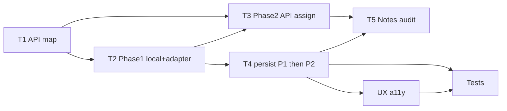

# Plan: Expert workflow (VietTune)

## Overview

**What:** Define and harden the end-to-end **Chuyên gia (Expert)** journey: landing experience, moderation queue, claiming/reviewing contributions, decisions (approve/reject/notes), and alignment with backend/admin APIs where the app is still local-first.

**Why:** Experts are a core trust layer between contributors and researchers. Today routing sends verified experts to `/moderation` (`MainLayout`), and `ModerationPage` combines rich UI with local storage patterns; the plan makes the workflow explicit, closes API gaps, and sets verification.

## Trạng thái triển khai (tóm tắt)

| Giai đoạn | Mô tả | Cách bật / ghi chú |
|-----------|--------|-------------------|
| **Phase 1** | UI `/moderation` + `expertWorkflowService`: queue base `GET /Submission/my`, overlay `EXPERT_MODERATION_STATE` (claim, verification, approve/reject notes). | Mặc định khi `VITE_EXPERT_API_PHASE2` không bật. |
| **Phase 2 (tùy chọn)** | Queue `GET /Submission/get-by-status` hoặc `GET /Admin/submissions`; claim/unclaim `POST /Admin/submissions/{id}/assign`; approve/reject `PUT /Submission/approve-submission` / `reject-submission`; vẫn merge overlay cho checklist & ghi chú expert. | `VITE_EXPERT_API_PHASE2=true`. Queue admin: `VITE_EXPERT_QUEUE_SOURCE=admin`. |
| **Chưa xong / rủi ro** | Metadata bản thu qua `PUT /Recording/{id}/upload` (OpenAPI); `POST` tạo notification có thể không có trong spec; map `SubmissionStatus` int 0–4 cần xác nhận với backend. | Xem [`EXPERT-WORKFLOW-API-MAP.md`](./EXPERT-WORKFLOW-API-MAP.md), [`PLAN-expert-role-apis.md`](./PLAN-expert-role-apis.md). |

## Project type

**WEB** (React/Vite SPA). Primary agent lane: `frontend-specialist`; backend/API work: `backend-specialist`; security-sensitive flows: `security-auditor` where auth/roles touch new endpoints.

## Success criteria (measurable)

1. An expert user can complete **discover → claim (or pick) → review media/metadata → decision → optional notes** without dead ends on supported paths.
2. **Role gating:** Non-experts cannot access expert-only routes/actions (existing `ForbiddenPage` patterns preserved or extended).
3. **State truth (phased):** **Phase 1** — queue and decisions consistent with **local storage / mock**; limitations and refresh behavior documented. **Phase 2** — khi bật env, queue và quyết định approve/reject đồng bộ server qua `expertWorkflowService` + `expertModerationApi`; overlay vẫn giữ phần server chưa lưu (verification wizard, notes). Refresh phản ánh backend cho trạng thái submission đã ghi qua API.
4. **Observability:** Admin/analytics can attribute work to experts where APIs exist (`GET /api/Analytics/experts`, admin submissions); full attribution may land in Phase 2 when APIs are wired.
5. **Phase X:** `npm run build` passes; manual smoke on `/moderation` as expert demo user; E2E Playwright (`npm run test:e2e`) cho happy path expert; run `python .agent/scripts/verify_all.py . --url http://localhost:3000` when server is up.

## Decisions (stakeholder)

- **A1:** “Workflow for expert” is scoped to **in-product** expert moderation, not Cursor `/plan` meta-process (see Appendix).

### Q1 — Moderation queue: API-backed vs phased

**Chọn: Phased (theo giai đoạn).**

- **Phase 1:** Hoàn thiện Expert UI và luồng tương tác (duyệt, filter, state từng bản thu) với **mock / local storage**, tránh block Frontend khi backend/schema còn đổi.
- **Phase 2:** **Đã có adapter frontend** (bật `VITE_EXPERT_API_PHASE2`): queue `get-by-status` hoặc Admin submissions; assign/unassign; approve/reject submission. Cần **xác nhận RBAC** trên môi trường thật (Expert có được gọi `/Admin/submissions/.../assign` hay không).

### Q2 — Annotations cùng epic hay tách milestone

**Chọn: Milestone riêng (không gộp epic kiểm duyệt cốt lõi).**

- **Epic hiện tại:** Ưu tiên **sàng lọc và ra quyết định** (approve / reject / chỉnh metadata cơ bản).
- **Milestone sau:** Annotations (học thuật, trích dẫn, liên kết chéo) — UI và DB phức tạp hơn; triển khai sau khi xương sống moderation đã ship.

**Theo dõi API:** `/api/Annotation/expert/{expertId}` và các endpoint Annotation chỉ nằm trong **roadmap milestone Annotations**, không là blocker cho Phase 1–2 của plan này.

## Tech stack (current)

- Frontend: React, TypeScript, Vite, Zustand (`authStore`), Lucide icons.
- Data: Mixed **local storage / demo overrides** and **REST**; expert moderation: `src/services/expertWorkflowService.ts`, `src/services/expertModerationApi.ts`, `src/config/expertWorkflowPhase.ts`, `src/services/submissionApiMapper.ts`, `src/services/recordingStorage.ts` (map submission). Tham chiếu OpenAPI: `swagger.txt` / Swagger host.

## Current flow (as-is snapshot)

| Step | Behavior | Primary files |
|------|----------|----------------|
| Login as Expert | Role `UserRole.EXPERT` | `authService.ts`, `authStore` |
| Home redirect | `/` → `/moderation` when authenticated expert | `MainLayout.tsx` |
| Moderation UI | Queue, filters, claim-by-expert semantics, AI review side flows | `ModerationPage.tsx` |
| Admin oversight | Users, analytics, moderation tab, expert deletion requests | `AdminDashboard.tsx` |
| Researcher consumption | Copy references expert-approved recordings | `ResearcherPortalPage.tsx` |

## Target file / module map

- `src/pages/ModerationPage.tsx` — main expert workflow surface (gọi `expertWorkflowService`).
- `src/services/expertWorkflowService.ts` — queue + claim / unclaim / approve / reject + overlay Phase 1; tích hợp API Phase 2 khi env bật.
- `src/services/expertModerationApi.ts` — HTTP queue, assign, approve/reject (Phase 2).
- `src/services/submissionApiMapper.ts` — chuẩn hoá payload submission → `LocalRecording`.
- `src/services/recordingStorage.ts` — `Submission/my`, `Submission/{id}` dùng mapper.
- `src/config/expertWorkflowPhase.ts` — `VITE_EXPERT_API_PHASE2`, `VITE_EXPERT_QUEUE_SOURCE`.
- `src/App.tsx` — routes (`/moderation`, admin `create-expert`).
- Types: `ModerationStatus`, `LocalRecording` trong `@/types`.

## Task breakdown

Tasks use **INPUT → OUTPUT → VERIFY** and explicit dependencies.

### T1 — Map expert workflow to API contracts

- **Agent:** `backend-specialist` (with `frontend-specialist` for UI field mapping).
- **Skills:** `plan-writing`, `clean-code` (for typing contracts).
- **Priority:** P0.
- **Dependencies:** None.
- **Deliverable:** [`docs/EXPERT-WORKFLOW-API-MAP.md`](./EXPERT-WORKFLOW-API-MAP.md) ✅
- **INPUT:** `swagger_summary.txt`, current `ModerationPage` data sources (grep: `fetch`, `getLocal`, `recordingRequestService`).
- **OUTPUT:** Short matrix: UI action → endpoint(s) → payload; list of **gaps** (no endpoint vs stub vs local-only).
- **VERIFY:** Document reviewed; each critical expert action has either “API” or “explicitly local + limitation” noted.

### T2 — Phase 1: Queue UX + local/mock source of truth + adapter boundary

- **Agent:** `frontend-specialist`.
- **Priority:** P0.
- **Dependencies:** T1.
- **INPUT:** Gap list from T1; current `ModerationPage` behaviors.
- **OUTPUT:** Luồng queue/filter/claim/decision chạy ổn trên **local/mock**; một **interface** (hoặc service layer) tách biệt UI khỏi nguồn dữ liệu để Phase 2 chỉ thay implementation (không đập component tree). Tài liệu ngắn: hành vi sau refresh, giới hạn đa chuyên gia (claim) khi chỉ local.
- **VERIFY:** Expert hoàn tất happy path trên Phase 1; refresh có hành vi **đã ghi rõ** (chấp nhận được cho mock); không còn “đang chờ quyết định API” để unblock UI.
- **Trạng thái:** ✅ `expertWorkflowService` + overlay; `ModerationPage` dùng `getQueue()` / các mutation service.

### T3 — Phase 2: Claim / assign qua Admin API

- **Agent:** `backend-specialist` + `frontend-specialist`.
- **Priority:** P1 (sau khi Phase 1 UX chốt).
- **Dependencies:** T1, T2.
- **INPUT:** `POST /api/Admin/submissions/{id}/assign` và các GET liên quan; matrix từ T1; implementation local hiện tại của `claimedBy`.
- **OUTPUT:** Implementation thứ hai của adapter: gọi API có xử lý lỗi/mạng; đồng bộ với quy tắc server (assign, unassign nếu có).
- **VERIFY:** Hai expert không giữ cùng một claim đang active theo server; refresh khớp backend.
- **Trạng thái:** 🟡 **Frontend đã nối** (bật env). **VERIFY** đầy đủ cần staging + 2 tài khoản Expert + backend cho phép assign.

**Cấu hình env**

| Biến | Ý nghĩa |
|------|---------|
| `VITE_EXPERT_API_PHASE2=true` | Bật queue/assign/approve/reject qua API như trên. |
| `VITE_EXPERT_QUEUE_SOURCE=by-status` *(mặc định)* | `GET /Submission/get-by-status` (fallback gọi theo từng `status` 0–4 nếu lần đầu rỗng). |
| `VITE_EXPERT_QUEUE_SOURCE=admin` | `GET /Admin/submissions` (cần quyền). |

**Luồng gọi (Phase 2):** assign `POST /Admin/submissions/{id}/assign` body `{ reviewerId }` / `{ reviewerId: null }`; approve `PUT /Submission/approve-submission?submissionId=`; reject `PUT /Submission/reject-submission?submissionId=`. Chi tiết ma trận endpoint: [`PLAN-expert-role-apis.md`](./PLAN-expert-role-apis.md). Mapper: `submissionApiMapper.ts`.

### T4 — Approve / reject / metadata — persistence (Phase 1 local → Phase 2 API)

- **Agent:** `frontend-specialist`.
- **Priority:** P1.
- **Dependencies:** T2.
- **INPUT:** Local persistence helpers; endpoint Media/Recording từ swagger (cho Phase 2).
- **OUTPUT:** **Phase 1:** persistence nhất quán trên local/mock + loading/error UX. **Phase 2:** chuyển ghi/đọc quyết định sang API trong cùng abstraction đã định nghĩa ở T2.
- **VERIFY:** Phase 1: quyết định sống qua refresh theo đúng spec local. Phase 2: researcher/admin thấy trạng thái khớp server.
- **Trạng thái:** 🟡 **Approve/reject** đã gọi API khi Phase 2 bật (cùng `expertWorkflowService`). **Metadata / Recording:** `setLocalRecording` dùng **`PUT /Recording/{id}/upload`** với payload `RecordingDto` (`recordingDto.ts` / `buildRecordingUploadPayload`). Vẫn cần VERIFY end-to-end trên staging.

### T5 — Expert notes & audit trail

- **Agent:** `frontend-specialist`, `security-auditor` (if PII).
- **Priority:** P2.
- **Dependencies:** T4 (Phase 1 tối thiểu); **T3** khi cần audit gắn assign server-side.
- **INPUT:** `expertNotes` patterns, `AuditLog` API (ưu tiên gắn Phase 2 nếu cần server truth).
- **OUTPUT:** Phase 1: notes local hoặc stub có đường migrate. Phase 2: lưu/ghi nhận theo policy + trace cho admin nếu API hỗ trợ.
- **VERIFY:** Một ca moderation mẫu để lại dấu vết theo đúng phase (local có doc; API có bản ghi hoặc log).
- **Trạng thái:** ✅ **Đã triển khai (frontend).**
  - **`expertWorkflowService`:** `EXPERT_REVIEW_NOTES_KEY` — `getExpertReviewNotes` / `setExpertReviewNotes` / `clearExpertReviewNotes`; sau approve/reject thành công (Phase 2) gọi `logExpertModerationDecision` → `postExpertModerationAuditLog` (`expertModerationApi.ts`); xóa overlay submission cũng xóa notes draft tương ứng.
  - **`ModerationPage.tsx`:** ô **Ghi chú chuyên gia** trong hộp thoại kiểm duyệt + panel chi tiết khi `IN_REVIEW` và đã claim; debounce lưu draft; gộp với ghi chú ở hộp thoại xác nhận phê duyệt/từ chối.
  - **Ghi chú backend:** payload AuditLog cần **xác nhận với team API** (field bắt buộc, RBAC, `id`/`createdAt` do server sinh hay client gửi).

### T6 — UX polish & accessibility

- **Agent:** `frontend-specialist` (skills: `frontend-design`, `tailwind-patterns`).
- **Priority:** P2.
- **Dependencies:** T4 (core flow stable).
- **INPUT:** Long `ModerationPage` interactions (dropdowns, modals, players).
- **OUTPUT:** Focus order, keyboard paths for primary actions, contrast checks.
- **VERIFY:** `ux_audit` script passes relevant gates; manual keyboard pass on claim + decision.
- **Trạng thái:** ✅ **Đã rà soát & chỉnh trên `ModerationPage.tsx`.**
  - Tab **Cổng chuyên gia:** `role="tablist"` / `tab` / `tabpanel`, roving `tabIndex`, phím mũi tên / Home / End.
  - **Hàng đợi:** `aria-live="polite"` (thông báo khi số mục danh sách đã lọc thay đổi); hàng chọn bằng role button + Enter/Space; vùng media `role="region"` + `aria-label`.
  - **Modal:** `role="dialog"` / `alertdialog`, `aria-modal`, `aria-labelledby`; Escape chỉ đóng **lớp trên cùng**; focus ban đầu vào panel kiểm duyệt; `SearchableDropdown` hỗ trợ listbox/`aria-controls`, Escape, phím mũi tên mở menu.
  - **Tailwind:** `focus-visible:ring-*` + `ring-offset` trên nút, checkbox, radio, textarea; validation bước form `role="alert"`.

### T7 — Tests (E2E / integration)

- **Agent:** `test-engineer`.
- **Priority:** P3.
- **Dependencies:** T4 minimum.
- **INPUT:** Playwright; seed auth + mock API cho queue/submission.
- **OUTPUT:** Smoke E2E: expert → `/moderation` → claim → ghi chú chuyên gia → hoàn tất wizard → xác nhận phê duyệt → assert trạng thái **Đã được kiểm duyệt** trên hàng đợi.
- **VERIFY:** `npm run test:e2e` xanh (local/CI); lần đầu: `npx playwright install chromium`.
- **Trạng thái:** ✅ **Đã thêm suite tối thiểu.**
  - **File:** `tests/e2e/expert-moderation.spec.ts`
  - **Cấu hình:** `playwright.config.ts` (`baseURL` port **3000** như `vite.config.ts`; `webServer` + `VITE_EXPERT_API_PHASE2=false`).
  - **Kỹ thuật:** `localStorage` seed `user` + `access_token` (hydrate → IndexedDB); `page.route` mock `GET /Submission/my`, `GET /Submission/{id}`, và vài endpoint Phase 2 dự phòng.
  - **Lưu ý locator:** nút “Tiếp tục (Bước N)” có **`aria-label` “Chuyển tới bước N”** — test dùng accessible name, không chỉ text hiển thị.

## Milestone: Annotations (out of scope)

Không thuộc epic này. Khi bắt đầu, lập plan riêng (ví dụ `docs/PLAN-annotations-expert.md`) với phạm vi UI + schema + `/api/Annotation/*`.

## Dependency graph (high level)

## Phase X: Verification checklist

- [ ] `npm run lint` and `npx tsc --noEmit` (or project equivalents)
- [ ] `npm run build`
- [ ] `npm run test:e2e` (Playwright; cần `npx playwright install chromium` nếu máy chưa có browser)
- [ ] Manual: expert demo login → `/moderation` → full happy path (Phase 1 và, nếu bật env, Phase 2 với API thật)
- [ ] Phase 2 (nếu dùng): smoke assign + approve/reject trên staging; xác nhận không 403 trên `/Admin/submissions/.../assign` (hoặc chuyển sang queue `by-status` only); xác nhận **AuditLog** (T5) nếu bật Phase 2
- [ ] `python .agent/scripts/verify_all.py . --url http://localhost:3000` (dev server running)
- [ ] No new secrets in client; role checks for expert routes; **không commit** `VITE_EXPERT_API_PHASE2=true` vào production nếu chưa chốt RBAC
- [ ] Q1/Q2 decisions reflected in implementation (phased queue + annotations deferred)

---

## Appendix: Using `/plan` as an “expert” kit user

- Invoke **`/plan <short goal>`** in Cursor; the model reads `.agent/workflows/plan.md` and should emit **`docs/PLAN-{slug}.md`** only (no code in plan mode).
- After review, run **`/create`** to implement, then **`/test`** / Phase X scripts before calling work done.
